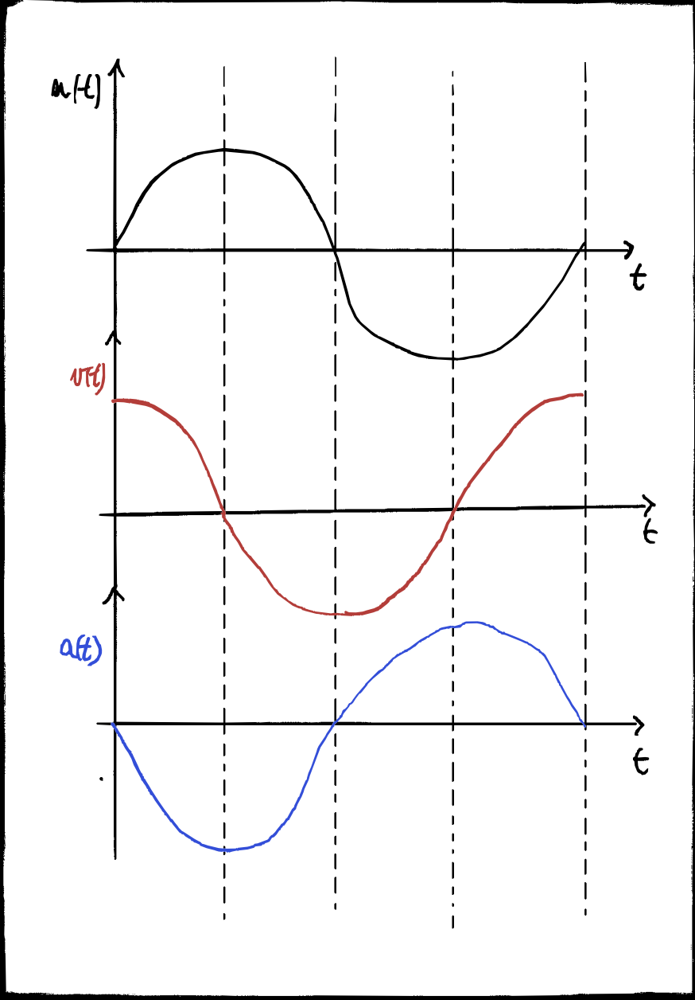

# Cinematica

---
## Cos’è la gittata?
Come detto nel [moto parabolico](#moto-parabolico) la gittata indica la distanza orizzontale dal punto di lancio al punto di caduta al suolo.

---
## Pulsazione e frequenza
La pulsazione $\omega$ è la velocità con cui viene effettuata un'oscillazione nel moto armonico $$\omega = \frac {2\pi}T$$ con $T$ periodo del moto.
La frequenza determina determina invece quante oscillazioni vengono fatte al secondo: $$f = \frac 1 T = \frac \omega{2\pi}$$

## Moto Armonico Semplice

Un punto materiale segue un __moto armonico semplice__ se la sua legge oraria è definita come:
$$x(t) = A\sin (\omega t + \phi)$$

$A$, $\omega$ e $\phi$ sono quantità costanti e sono rispettivamente l'__ampiezza del moto__, la __pulsazione__ e la __fase iniziale__.

Il moto armonico semplice è un moto rettilineo vario in cui tutte le grandezze cinematiche che lo descrivono, $x(t)$, $v(t)$ e $a(t)$ variano nel tempo.

I valori estremi della funzione $\sin$ sono $1$ e $-1$ quindi il punto si muove in un segmento grande $2A$ con centro nell'origine. Al tempo $t=0$ il punto si trova in: 

$$x(0) = A\sin(\phi)$$ 

Quindi note $A$ e $\phi$ si può determinare la posizione iniziale del punto.

Sappiamo che la funzione seno è periodica con periodo $2\pi$. Quindi se consideriamo due tempi $t$ e $t'=t+T$ sappiamo che per definizione: 
$$\omega t' + \phi = \omega t + \phi + 2 \pi  $$

$$\cancel{\omega t} + \omega T +  \cancel\phi =  \cancel{\omega t }+ \cancel \phi + 2 \pi $$

$$T = \frac {2\pi}\omega$$

La velocità del punto si ottiene derivando $x(t)$: 

$$v(t) = \omega A cos(\omega t + \phi)$$

L'accelerazione si ottiene con un ulteriore derivazione:

$$a(t) = -\omega ^2 A \sin (\omega t + \phi) = -\omega ^2 x(t)$$

 
Una condizione sufficiente affinché un moto sia armonico è che l'accelerazione del corpo sia proporzionale e di verso opposto allo spostamento rispetto alla posizione di equilibrio, indicando la presenza di una forza di richiamo (o forza restauratrice) che tende a riportare il corpo verso tale posizione.

## Moti su traiettoria curvilinea
Per descrivere il moto su una traiettoria curvilinea possiamo utilizzare anche una sola coordinata, fissata l'origine arbitraria sulla traiettoria, possiamo utilizzare un'__ascissa curvilinea__ che altro non è che la lunghezza del tratto di traiettoria dall'origine.

Quindi conoscendo la traiettoria, possiamo descrivere completamente il moto tramite questa ascissa curvilinea. 

L'incremento infinitesimo del raggio vettore $d\vec r$ ha direzione tangente alla curvatura nel punto P e in modulo sarà uguale allo spostamento infinitesimo $ds$ (arco di curva del percorso): $$d\vec r = ds \cdot \vec u_T$$

Possiamo pensare quindi al moto come una successione di spostamenti rettilinei infinitesimi con direzione variabile. 

La velocità quindi avrà stessa direzione e verso di $d\vec r$: 

$$\vec v= \frac {d \vec r}{dt} = \frac {ds}{dt}\cdot \vec u_T = v \cdot \hat u_T$$

Si noti che questo è vero solo a livello infinitesimo, se andiamo a considerare uno spostamento finito avremo che $\Delta \vec r$ rappresenta la corda, mentre $\Delta \vec s$
rappresenta l'effettiva lunghezza del tratto di curvatura.

L'accelerazione avrà due componenti, una che influirà sul modulo della velocità e una sulla sua direzione:
$$\vec a = \frac {d\vec v}{dt} = \frac{d}{dt}(v\cdot \vec u_T) = \frac{dv}{dt}\vec u_T + v \frac{d \vec u_T}{dt} = \frac{dv}{dt}\vec u_T + v \frac{d\theta}{dt}\vec u_N$$

>
>Ma perché abbiamo che $\frac{d\vec u_T}{dt} = \frac{d\theta}{dt}\vec u_N$ ? 
>
> A livello geometrico abbiamo che $\vec u(t)$, $\vec u(t + \Delta t)$ e $d\vec u$ formano un triangolo isoscele, con $\Delta t \rightarrow 0$ si ha che $\theta \rightarrow 0$, con $\theta$ l'angolo al centro di curvatura. 
>
>Questo significa che gli altri due angoli tendono a $\frac \pi 2$. 
>
>Possiamo però provarlo matematicamente, considerando che $\lvert \lvert\hat u\rvert\rvert = 1$  perché è un versore quindi anche il prodotto scalare $\hat u \cdot \hat u = \lvert \lvert\hat u\rvert\rvert^2 = 1$. 
>
>Quindi la derivata del prodotto scalare del versore con se stesso è costante perciò la sua derivata è zero:
> $$\frac{d(\hat u \cdot \hat u)}{dt} = 0$$
> Si applica la regola della derivazione per il prodotto scalare:
> $$\frac{d(\hat u \cdot \hat u)}{dt} =\frac{d\hat u}{dt} \cdot \hat u + \hat u \cdot \frac{d\hat u}{dt}  = 2 \hat u \cdot \frac{d\hat u}{dt} =0$$
> Si vede dall'ultima uguaglianza che $\hat u \perp d\hat u$.
> Per il modulo invece sappiamo che l'arco è uguale al raggio per l'angolo da cui per valori infinitesimi in cui la corda si confonde con l'arco abbiamo che: $$du = \lvert\lvert u(t)\rvert\rvert \cdot d\theta = d\theta $$
> Infine:$$\frac{d\hat u}{dt} = \frac{d\theta}{dt}\hat u_N$$

 

Il termine $v \frac{d\theta}{dt}\vec u_N$ determina quanto velocemente cambia direzione la velocità, in termini infinitesimi le rette normali alla traiettoria si incontreranno in un punto che coincide con il centro di una circonferenza tangente alla traiettoria in quel punto, esso viene chiamato __centro di curvatura__ della traiettoria nel punto P. Al variare del punto P il centro di curvatura e quindi anche il __raggio di curvatura__ cambiano. 
L'arco di traiettoria $ds = R \cdot d\theta$ con $R$ raggio di curvatura:
$$\frac{d\theta}{dt} = \frac{d\theta}{ds} \frac {ds}{dt} = \frac{1}{R} v$$
Sostituendo otteniamo:
$$\vec a = \frac{dv}{dt}\vec u_T + \frac{v^2}{R}\vec u_N$$

### TODO 
- traduzione in coordinate cartesiane nel piano

---
## Moto circolare
Si chiama moto circolare un moto la cui traiettoria è rappresentata da una circonferenza. Notando che la velocità cambia continuamente in direzione l'accelerazione centripeta è sempre diversa da zero.

### Uniforme
Nel caso il modulo della velocità sia costante allora il moto sarà __uniforme__ per cui: 
$$\lvert\vec  v\rvert = cost \quad \Rightarrow \quad \vec a = \vec a_N$$
Essendo il modulo della velocità costante allora sicuramente il punto percorrerà la circonferenza in un certo periodo e per definire il moto ci basta conoscere appunto il periodo ed il raggio della circonferenza che possono essere messi in relazione come segue:

$$T = \frac C v = \frac {2\pi R}{v} $$

### Rappresentazione con ascissa curvilinea
Si può descrivere il moto in relazione allo spazio percorso sulla circonferenza 

$$s(t) = \theta(t) R$$

### Rappresentazione polare
Per descrivere il moto possiamo utilizzare un sistema di coordinate polari con origine nel centro della circonferenza in cui $r(t) = R = cost$ e l'angolo $\theta(t)$ variabile. 

### Rappresentazione cartesiana

$$\theta(t) = \begin{cases} 
x(t) = R\cos(\theta(t)) \\ 
y(t) = R\sin(\theta(t)) \\
\end{cases}$$

Si definisce __velocità angolare__ istantanea la derivata rispetto al tempo dell'angolo $\theta(t)$ che descrive la posizione angolare del punto: 

$$\omega = \frac {d\theta}{dt} $$

Che può venire espressa come:

$$\omega = \frac {d\theta}{dt} = \frac 1 R \frac {ds}{dt} = \frac v R$$

La velocità sarà sempre tangente alla circonferenza nel punto come visto nel [moto piano](#velocità-tangente) e l'accelerazione a sua volta sarà perpendicolare alla velocità (sempre come visto nel [moto piano](#derivata-versore)) quindi l'accelerazione punterà sempre verso il centro della circonferenza (perché perpendicolare alla tangente). 
Un altro modo per mostrare che l’accelerazione è perpendicolare alla velocità è quello di __disegnare i vettori velocità traslati nello stesso punto__ e calcolare $d\vec v$, ossia la variazione infinitesima della velocità.

Quindi l'accelerazione nel moto circolare uniforme è sempre diretta verso il centro ed è chiamata __centripeda__.
Quanto vale?

$$\vec a_c = \frac {d\vec v}{dt} = \frac {d(v\cdot \hat u_T)}{dt}= \cancel{\frac{dv}{dt}\cdot \hat u_T} + v\cdot \frac {d\hat u_T}{dt} = v\cdot \frac {d \theta}{dt}\cdot \hat u_N = v   \cdot \omega \cdot \hat u_N =    \frac {v^2} R \cdot \hat u_N$$

In modulo

$$a_c = \frac {v^2}R = \omega ^2 R$$

---
### Non uniforme
Nel moto circolare non uniforme l'accelerazione ha una componente tangenziale in quanto il modulo della velocità non è costante quindi l'accelerazione angolare:

$$\alpha = \frac {d \omega}{dt} = \frac 1 R\frac {dv}{dt} = \frac {a_T}R$$

#### TODO
- leggi orarie di $\omega(t)$ e $\theta(t)$

---
## Moto parabolico
Il moto parabolico avviene quando un punto viene lanciato con una velocità iniziale $\vec v_0$ avente un angolo $\theta$ con il suolo (detto __angolo di alzo__).

Di questo moto si vogliono conoscere la __traiettoria__, la __massima altezza__ e la __gittata__ che è la distanza orrizontale dal punto in cui viene lanciato al punto in cui cade al suolo.

Dal momento in cui il punto è stato lanciato esso avrà un'accelerazione di gravità $g = 9.81\,m/s^2$ e considerando un sistema di riferimento con $y$ che punta verso l'alto e $x$ concorde al suolo avremo che 

$$\vec g = -g\cdot \hat u_y$$

Si possono quindi scomporre velocità e accelerazione rispetto agli assi $x$ e $y$.
$$
\begin{cases}
x(t) = v_0\cdot \cos (\theta) t\\
y(t) = v_0\cdot \sin (\theta) t - \frac 12 gt^2 \\
\end{cases}
$$

Per trovare la traiettoria eliminiamo il tempo nelle due espressioni con
$$t=\frac x{v_0\cos \theta}$$

$$y(x) = x\tan \theta - x^2\frac {g}{2v_0^2\cos^2\theta}$$

Che è l'equazione di una __parabola__.

Per calcolare la __gittata__ basta porre $y(x) = 0$ e otteniamo due soluzioni, scartiamo quella $x=0$ che corrisponde all'inizio della traiettoria e ricordando la formula di duplicazione $\sin(2\phi) = 2 \sin \phi \cos \phi$ otteniamo
$$0 = \cancel x(\tan \theta - x \frac {g}{2v_0^2 \cos^2 \theta})$$
$$x_G = \frac {v_0^2\sin (2\theta)}g$$

Ottenuta la gittata possiamo calcolare l'__altezza massima__ sapendo che la parabola è simmetrica e quindi $x_M = \frac{x_G}2$

$$y(x_M) = \frac {2v_0^2\cos\theta\sin \theta}{2g} \tan \theta - \bigg(\frac {2v_0^2\cos\theta\sin \theta}{2g} \bigg)^2\frac g {2v_0^2cos^2\theta}$$

$$= \frac{2v_0^2\sin^2\theta}{2g}-  \frac {2v_0^2\sin^2 \theta}{4g} = y_M = \frac {v^2_0\sin^2\theta}{2g}$$

### todo
- angolo di lancio con gittata maggiore (hint: $\frac {dx_G}{d\theta}$)

---
## Decomposizione delle accelerazioni nei moti piani.

Considerando un [moto curvilineo](#moti-su-traiettoria-curvilinea), ed individuato il __raggio di curvatura__ si possono individuare due componenti dell'accelerazione. 

Una componente __tangenziale__ che va a descrivere come cambia il modulo della velocità e una componente __normale__ che va a descrivere come cambia la direzione della velocità. 

---
