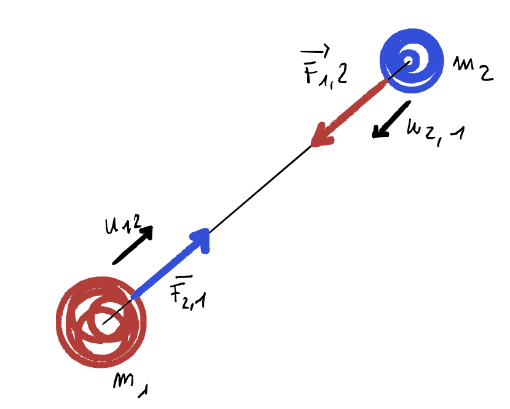
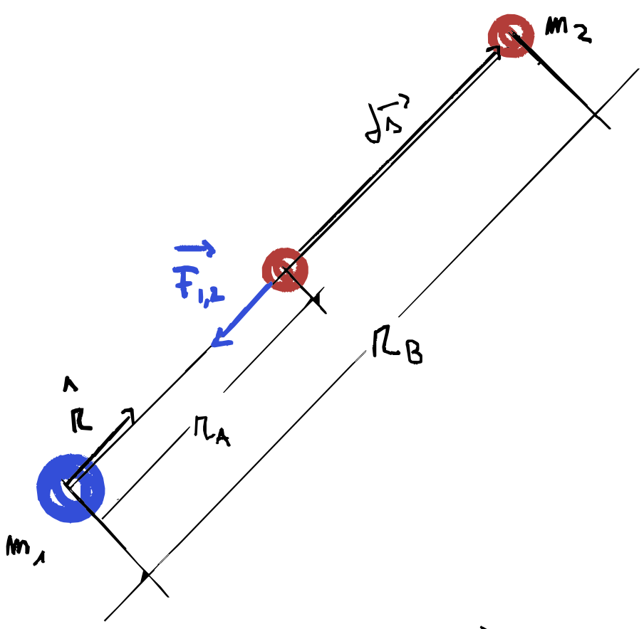
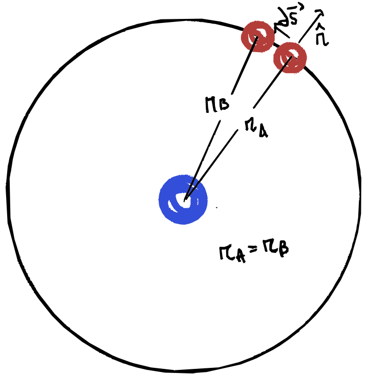
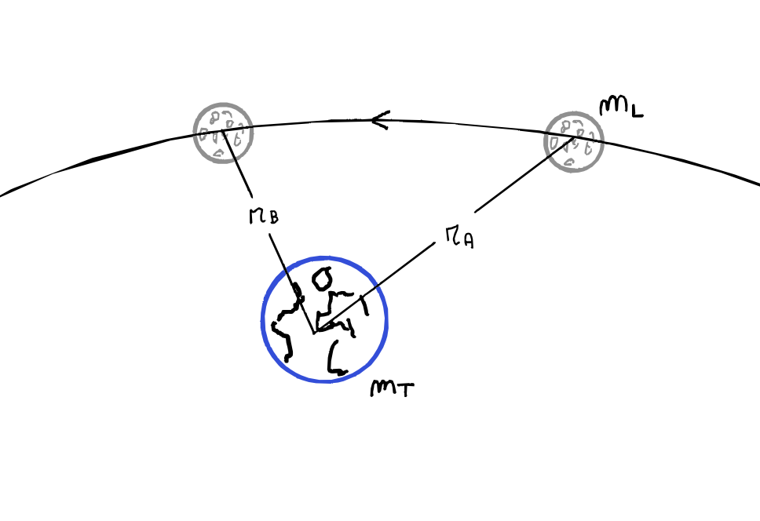

# Forza Gravitazionale
## Legge di gravitazione universale

> Date due masse $m_1$ e $m_2$ qualsiasi, di dimensioni trascurabili rispetto alla distanza mutua, tra di esse agisce una forza attrativa diretta lungo la retta che congiunge le due masse, il cui modulo dipende dal prodotto delle due masse ed è inversamente proporzionale al quadrato della distanza 
>

>$$
\vec F_{1,2} = -\gamma\frac {m_1m_2}{r^2} \hat r_{1,2}
$$

Considero un grave qualsiasi sulla superficie terrestre e applico la seconda legge della dinamica:

$$
\large
\begin{cases}
    \vec F = m \vec a = m_i g \hat r\\
    \vec F = \gamma \frac {m_gM_T}{r^2} \hat r  
\end{cases} \quad \Rightarrow \quad m_ig = \gamma\frac {m_gM_T}{r^2}
$$

- $m_g$ e $m_i$ anche se sono riferite allo stesso corpo, non sono concettualmente la stessa cosa:
    - la __masssa gravitazionale__: caratteristica del un corpo di attrarre e essere attratto secondo la legge di gravitazione universale
    - la __massa inerziale__: caratteristica del corpo a resistere al cambiamento del proprio stato di moto quando sottoposto a una forza
    - il loro rapporto $\frac{m_i}{m_g} = \frac {M_T}{r^2 g}$ è una costante indipendentemente, dalla natura del corpo quindi loro sono perlomeno proporzionali e per questo caso di studio si può suppore che siano uguali e che il loro rapporto sia uguale a 1 cioè $m_i = m_g$
- il grave avrà una distanza nell'ordine di una decina di metri dalla superficie della Terra ed il raggio della terra è di circa $6.378 \cdot 10^6 m$ (10 metri sono trascurabili rispetto a 6 milioni di metri) quindi $$r\approx R$$
- il raggio della terra era stato calcolato già al tempo degli egizi da [Eratostene](https://www.roma1.infn.it/exp/webmqc/Il%20metodo%20di%20Eratostene.pdf)
- $\large \gamma$ è la __costante gravitazionale universale__ misurata sperimentalmente da __Cavendish__ tramite l'utilizzo di una bilancia di torsione e vale $$\gamma = 6.67 \cdot 10^{-11} \bigg[\frac {m^3}{kg\,s^2} = \frac {Nm^2}{kg^2}\bigg]$$

> La massa della Terra quindi può essere calcolata a partire dalle assunzioni appena fatte come:
>
>$$M_T = \frac{g R^2}\gamma$$

---
## domande


##### {{ counter }}) Forza di gravità. Cos’è il versore che appare nell'equazione? È una forza fondamentale? Si enunci qualche effetto macroscopico della forza di gravità. La massa della forza peso è la stessa che compare nell’equazione della forza di gravità?

Data l'[equazione](#legge-di-gravitazione)
###### a) Cos'e $\hat r_{1,2}$?
Il versore $\hat r_{1,2}$ è quel versore che ha direzione sulla retta che congiunge le due masse e verso dalla massa 1 alla massa 2. Il segno meno nell’equazione indica che la forza è attrattiva, quindi agisce in direzione opposta al versore (cioè dalla massa 2 verso la massa 1).
###### b) E' una forza fondamentale?
Si la forza gravitazionale è una delle quattro forze fondamentali della natura (insieme alla forza elettromagnetica, nucleare forte e nucleare debole).
###### c) Si enunci qualche effetto macroscopico della forza di gravità.
- la __caduta dei gravi__ sulla Terra
- il __moto orbitale__ della luna attorno alla terra
- la possibilità di misurare la costante gravitazionale $\gamma$ (esperimento di Cavendish con una bilancia di torsione)

###### d) La massa della forza peso è la stessa che compare nell’equazione della forza di gravità?

Vedi [qui](#massa-inerziale-gravitazionale).

---

##### {{ counter }}) Se fossimo in orbita, ma poi siamo fermi e ci lasciano cadere verso la terra dentro uno scatolone, avremmo una sensazione del peso?

In questo scenario l’unica forza che agisce sul corpo è la gravità. Siamo in __caduta libera__, quindi il nostro eventuale contatto con la base della scatola non eserciterebbe su di noi la reazione vincolare che sperimentiamo normalmente sul suolo terrestre. Per questo, durante la caduta libera non percepiamo alcuna __sensazione di peso__.

Anche un corpo in orbita è in caduta libera continua, ma con una velocità tangenziale sufficiente a evitare una caduta verticale ed un incontro molto spiacevole con il suolo terrestre. 

Spiacevole perché nel momento del contatto con il suolo, subiremo una decelerazione quasi istantanea, che ci farebbe percepire un peso molto maggiore. In un certo senso, "__recupereremmo__" tutto il peso perso durante la caduta.

###### ESEMPIO (mezzo fuori tema)

Per esempio, se all'interno di una scatola fossimo in caduta libera da un'altezza di:

$$h = 100\,m$$

arriveremo al suolo con una velocità:

$$v = \sqrt {2gh} = 44.3 \;m/s $$

e supponiamo che al momento dell'impatto ci fermiamo in un tempo di

$$
t_{impatto} = 0.2 s
$$

allora la decelerazione media durante l'urto sarebbe:

$$
\overline a_{impatto} = \frac{44.3}{0.2} = 221.4 \;\frac m {s^2}
$$

quindi il peso apparente in quei $0.2$ secondi sarebbe:

$$
P = m(\overline a_{impatto} + g) \eqsim m\cdot  230\ \; N
$$

Quindi peseremmo circa __23 volte__ in più: per una persona di $80\;kg$ una bilancia segnerebbe $1840\;kg$.

Facendo gli stessi calcoli, dalla stazione spaziale con un altezza $h\simeq 4 \cdot 10^5 \;m$ la bilagna segnerebbe circa $112'000 \;kg$ durante l'impatto!!

---

##### {{ counter }}) Ci lanciano da un’astronave verso la terra dentro uno scatolone chiuso. Si avvertono variazioni nella propria sensazione di peso?
Vedi [sopra](#-counter--se-fossimo-in-orbita-ma-poi-siamo-fermi-e-ci-lasciano-cadere-verso-la-terra-dentro-uno-scatolone-avremmo-una-sensazione-del-peso).

---

##### {{ counter }}) Legge di gravitazione universale. Se ho quattro laptop in un cesto e quattro laptop in un altro cesto, e sposto due laptop nell’altro cesto, come cambia la forza?

La massa iniziale dei due cesti $m_i$ sarà la somma di 4 laptop $m_l$:

$$
m_{i} = 4\cdot m_{l}
$$

Quindi la forza che esercitano tra loro in modulo:

$$
F_i = \gamma \frac {m_{i}^2}{d^2} = \gamma \frac {16\cdot m_{l}^2}{d^2}
$$

Dopo aver spostato due laptop da una cesta all'altra la forza sarà:

$$
F_f = -\gamma \frac {6\cdot m_{l}\cdot 2 \cdot m_{l}}{d^2} = -\gamma \frac {12\cdot m_{l}^2}{d^2}
$$

$$
F_f = \frac{12}{16}\cdot F_i \quad F_f = \frac 34 \cdot F_i
$$

Quindi la forza gravitazionale finale sarà tre quarti rispetto a quella iniziale.

---

##### {{ counter }}) Energia potenziale gravitazionale. [forse extra]

Il lavoro per la forza gravitazionale secondo la definizione:

$$
dW = \vec F_{1,2} \cdot d\vec s = -\gamma \frac {m_1\,m_2}{r^2} \hat r \cdot d\vec s
$$

Se andiamo a considerare il caso in cui $m_2$ si allontani da $m_1$ lungo la direzione che li congiunge andando a finire ad una distanza $r_B > r_A$, allora la forza gravitazionale avrà esercitato un lavoro negativo. 

Inoltre essendo lo spostamento collineare con la retta che congiunge le due masse il prodotto scalare:

$$
\hat r\cdot d\vec s = dr
$$

Se invece consideriamo il caso in cui $m_2$ orbiti seguendo una traiettoria perfettamente circolare.

Allora la distanza tra le masse rimarrebbe costante e il prodotto scalare tra $\hat r$ e $d\vec s$ diventerebbe nullo:

$$
\hat r \cdot d \vec s = 0 \quad \mathtt{perché} \quad \hat r \perp d\vec s
$$

Quindi pensando ad un orbita ellittica il lavoro della forza gravitazionale sarà funzione della distanza radiale, quindi non dipenderà dal percorso e perciò è una __forza conservativa__.

Il lavoro sarà definito come:

$$
W_{A\rightarrow B} = \int_{r_A}^{r_B} -\gamma\frac {m_T\,m_L}{r^2} dr = -\gamma \,m_T\,m_L \int_{r_A}^{r_B} \frac 1{r^2}dr =  -\gamma \,m_T\,m_L \left[-\frac 1 {r}\right]_{r_A}^{r_B} = \cdots
$$

$$
\cdots = -\gamma \,m_T\,m_L \left(-\frac 1 {r_B} + \frac 1 {r_A}\right) = \gamma\frac {m_T\,m_L}{r_B} - \gamma\frac {m_T\,m_L}{r_A} = -\Delta U
$$

Quindi l'energia potenziale sarà:

$$
U(\vec r) = -\gamma \frac {m_T\,m_L}r
$$

###### TODO aggiungere ragionamento con il sistema di riferimento polare?

---

