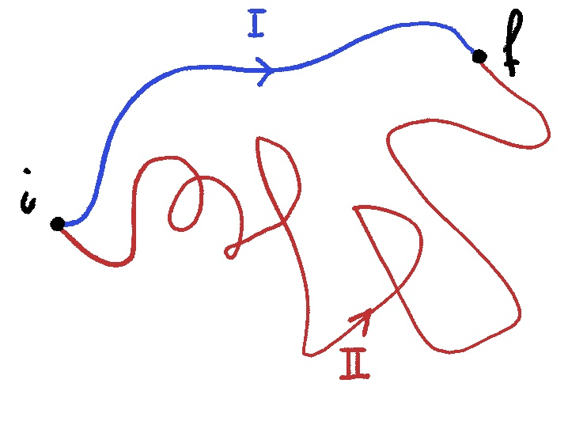

# Lavoro ed Energia
## Lavoro
Il lavoro viene definito quando si mette la __forza__ in funzione della posizione occupata dal punto, in particolare il lavoro infinitesimo $dW$ compiuto dalla forza è definito come il [prodotto scalare](vettori.md#prodotto-scalare) della forza per lo spostamento:

$$
dW = \vec F \cdot d\vec r = F dr\cos \theta
$$

Con $\theta$ l'angolo formato da $\vec F$ e $d\vec r$:
- $\theta \in \big[0,\frac \pi 2\big[$ allora la proiezione della forza è concorde allo spostamento ed il lavoro è positivo 
- $\theta = \frac \pi 2 \Rightarrow \cos \theta = 0$ e il lavoro diventa nullo
- $\theta > \frac \pi 2$ in questo caso la proiezione della forza è contraria allo spostamento ed il lavoro diventa negativo

Il lavoro è quella quantità che indica quanto una forza sta contribuendo allo spostamento, se:
- è positivo si dice __lavoro motore__
- è negativo si dice __lavoro resistente__
- altrimenti si dice __lavoro nullo__

Se si considera uno spostamento finito da __A__ a __B__, dividendo la traiettoria in segmenti infinitesimi si può andare a calcolare il lavoro per ognuno di loro andando poi a sommarli insieme:

$$
W_{tot} = \sum _{i=1}^N dW_i = \sum _{i=1}^N \vec F_i\cdot d\vec r_i
$$

con $N\rightarrow \infty$

> Il lavoro è definito come:
>$$ W_{A\rightarrow B} = \int_A^B \vec F\cdot d\vec r $$
>
> ovvero l'integrale di linea della forza lungo la traiettoria.

L'unità di misura del lavoro è il __newton per metro__ che si chiama joule (pronuncia _giul_):

$$
N\cdot m = kg \frac {m^2}{r^2} = J 
$$

---
## Energia cinetica

La definizione di __lavoro__ é:

$$ 
W_{i\rightarrow f} = \int_i^f \vec F\cdot d\vec r =\int_i^f F_T \cdot dr
$$

Facendo uso dell'equazione di Newton:

$$
W_{i\rightarrow f} = \int_i^f m a_T \cdot d r = m\int_i^f \frac{d v }{dt} \cdot d r = m\int_i^f \frac{dr}{dt} dv = m\int_i^fvdv 
$$

$$
W_{i\rightarrow f} = \frac 12 mv_f^2 - \frac 12 mv_i^2 = E_{k,f} - E_{k,i}
$$

In cui la quantità $\frac 12 m v^2$ prende il nome di energia cinetica.

> Il __teorema__ dell'energia cinetica (__teorema delle forze vive__) afferma che:
>
>il lavoro compiuto dalla risultante delle forza di un punto material da una posizione _iniziale_ ad una posizione _finale_ è uguale alla variazione di __energia cinetica__ del punto materiale in quel tragitto

---

## Forze conservative

### Forza Peso
Applicando la definizione del lavoro per la forza peso:

$$
W_{i\rightarrow f} = \int_i^f \vec F \cdot d\vec r = \vec F\cdot \int_i^f d\vec r = m\vec g\cdot(\vec r_f - \vec r_i)
$$

Ora scomponiamo nei suoi componenti $\Delta \vec r$

$$
(\vec r_f - \vec r_i) = [(x_f -x_i)\hat x + (z_f -z_i)\hat z]
$$

ricordando che $\hat z \cdot \hat x = 0$ otteniamo:

$$
W_{i\rightarrow f} = -mg\hat z\cdot [(x_f -x_i)\hat x + (z_f -z_i)\hat z] = -mg(z_f-z_i)
$$

Si noti che $z_f - z_i <0$ quindi $W_{i\rightarrow f} > 0$

> E' importante notare che data la formula ottenuta:
>
>$$
>W = -(mgz_i - mgz_i)
>$$
>
> il lavoro della forza peso non dipende dal percorso compiuto dalla massa, ma solamente dalla posizione iniziale e finale della massa

---

### Forza elastica
Applicando la definizione del lavoro per la forza elastica:

$$
W_{i\rightarrow f} = \int_i^f \vec F \cdot d\vec r = \int_i^f -kx\hat u_x \cdot d\vec x \hat u_x = -\bigg(\frac12 kx^2_f - \frac12 kx^2_i\bigg)
$$

Anche in questo caso il lavoro dipende solo dalla posizione iniziale e finale.

### Forze conservative
Il lavoro della forza peso e della forza elastica dipende solamente dalla posizione iniziale e finale e non dal particolare percorso, quindi presi due percorsi che iniziano per $i$ e finiscono per $f$:

$$
W = \int_i^f (\vec F_C \cdot d\vec r)_I = \int_i^f (\vec F_C \cdot d\vec r)_{II} = \int_i^f \vec F_C \cdot d\vec r
$$

Invertendo il senso di percorrenza da $f$ a $i$, il lavoro compiuto è lo stesso in modulo, ma di segno opposto.

>Un altra definizione per le __forze conservative__ é che lungo un qualsiasi percorso chiuso il loro lavoro è nullo.
>
>$$ \oint \vec F d\vec s = 0$$
>
>Scegliando arbitrariamente due punti $i$ e $f$ all'interno del percorso chiuso:
>
>$$ 
>\oint  \vec F d\vec s = 
>\int_i^f (\vec F d\vec s)_I + \int_f^i (\vec F d\vec s)_{II} =  
>\int_i^f (\vec F d\vec s)_{I} - \int_i^f (\vec F d\vec s)_{II} = 0
>$$
>
>$$ \Rightarrow \int_i^f (\vec F d\vec s)_{I} = \int_i^f (\vec F d\vec s)_{II} $$

## Forze non conservative (attrito radente)
Il lavoro della forza di attrito radente è dato:

$$
W = \int_i^f \vec F_a \cdot d\vec s = -\mu_d \int _i^f N\hat u_v\cdot  d\vec s
$$

con $\hat u_v$ versore della velocità (la forza d'attrito è sempre contraria al moto del corpo) e nel caso la reazione vincolare $N$ sia costante:

$$
W = -\mu_d N\int_i^f ds = -\mu_d Ns_{i\rightarrow f}
$$
Con $s_{i\rightarrow f}$ è la lunghezza del percorso, misurata lungo l'effettiva traiettoria del punto materiale.

> Il lavoro della forza d'attrito radente dipende dal percorso e non è esprimibile tramite differenza dei valori di una funzione delle coordinate iniziali e finali.
>
> Inoltre il lavoro della forza attrito è sempre negativo.

## Energia potenziale

Il lavoro delle forze conservative dipende solo dalle posizioni iniziali e finali, quindi fissata una posizione di riferimento $O$ e considerando due posizioni $i$ e $f$:

$$
W_{O\rightarrow O} = W_{Oi} + W_{if} + W_{fO} = 0
$$

Perché appunto un percorso chiuso e quindi possiamo ricavarci:

$$
W_{if} = - W_{Oi} - W_{fO} = - W_{Oi} + W_{Of} 
$$

> Quindi definiamo come __energia potenziale__:
>
> $$
> U_P = - W_{OP} 
> $$
>
> Da cui possiamo quindi calcolare 
> $$W_{i\rightarrow f} = - (U_f - U_i)$$
>
> PROPRIETÀ:
> - l'energia potenziale può essere definita solo per le __forze conservative__
> - per tutte le forze conservative il lavoro si esprime come l'opposto della variazione di energia potenziale 
> - l'espressione per l'energia potenziale dipende dal tipo di forza e si ricava da
> $$U(\vec x_p) = - \int_O^P \vec F \cdot d\vec s$$
> - l'energia potenziale è la __primitiva__ della forza

Da notare che l'energia potenziale in un punto di per se non ha molto senso poiché dipende dalla scelta di $O$, ma ha senso parlare di differenza di energia potenziale che non dipende dalla scelta del riferimento.

## Enerigia Meccanica e Teorema di conservazione dell'energia meccanica
Se agiscono solo forze conservative allora sono valide:

$$
\begin{cases}
W  =  E_{k, f} - E_{k, i} && \footnotesize\mathtt{Energia\;Cinetica}\\ 
\\
W = U(\vec x_i) - U(\vec x_f) && \footnotesize\mathtt{Energia\;Potenziale}\\ 
\end{cases}
$$
Eguagliando le due relazioni si ottiene: 

$$
E_{k, i} + U(\vec x_i) = E_{k, f} + U(\vec x_f)
$$

>Tale somma si chiama __energia meccanica__ e tale uguaglianza esprime il __principio di conservazione dell'energia meccanica__:
> - in presenza di forze conservative l'energia meccanica di un punto materiale si conserva:
>
> $$E_m = E_k + U = cost$$

In generale non agiscono mai solo forze conservative, ma c'è sempre qualche forza non conservativa in gioco (attriti vari ...) quindi l'energia meccanica non è mai costante.

> In presenza di forze non conservative l'energia meccanica non resta costante e la sua variazione è uguale al lavoro delle forze non conservative:
>
> $$W_{nc} = E_{m, i} - E_{m, f}$$

---
## Domande


##### {{ counter }}) Parla della conservazione dell’energia meccanica.
Vedi l'[energia meccanica](#enerigia-meccanica-e-teorema-di-conservazione-dellenergia-meccanica).

---

##### {{ counter }}) Forze conservative. Esempi di forze conservative e non conservative.
- [forze conservative](#forze-conservative)
- [forze non conservative](#forze-non-conservative-attrito-radente)

---

##### {{ counter }}) Definisci energia potenziale (in generale)
Vedi l'[energia potenziale](#energia-potenziale).

---

##### {{ counter }}) Cosa sono le forze dissipative? Che ruolo hanno nel teorema generale della conservazione dell’energia meccanica?
Per forza dissipative si intendono le [forze non conservative](#forze-non-conservative-attrito-radente), quindi che il lavoro su un percorso chiuso non è nullo:

$$\oint \vec F_{nc}\cdot d\vec s \ne 0 $$

Queste forze trasformano una parte dell'energia meccanica in altri tipi di energia, tipicamente energia termica.

---


##### {{ counter }}) definizione di energia potenziale. Cos’è una forza conservativa. Esempi di forze conservative.
- [energia potenziale](#energia-potenziale)
- [forze conservative](#forze-conservative)

---

##### {{ counter }})  Si definisca il lavoro. Analisi dimensionale e senso fisico. Significato del prodotto scalare.

- [lavoro](#lavoro)

---

##### {{ counter }}) Ho una pallina che cade (in acqua? su un pavimento?) e dopo un po’ si ferma. Cosa è successo? Se volessimo scrivere un bilancio energetico?

- todo (va introdotto il caso dell'urto con il pavimento?)

---

##### {{ counter }}) Si enunci il principio di conservazione dell’energia meccanica, nella maniera più generale consosciuta.

- [lavoro forze non conservative e energia meccanica](#conservazione-energia-meccanica-fnc) 

$$
E_{m,i} = E_{m_f} + W_{nc}
$$

---

##### {{ counter }}) Teorema delle forze vive?
- [teorema energia cinetica](#teorema-energia-cinetica)

---

