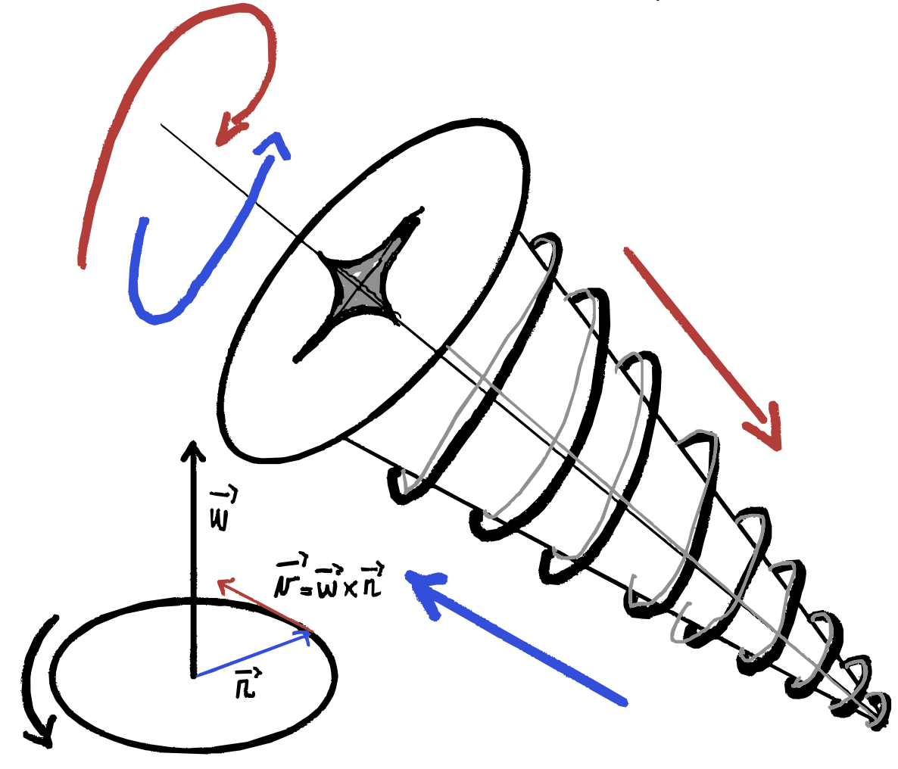

# Sistemi di riferimento

## Premesse
### Velocità angolare notazione vettoriale

Si definisce velocità angolare il vettore $\vec \omega$:

- il modulo vale $\vec \omega = \frac {d\theta}{dt}$
- la direzione è ortogonale al piano in cui giace la circonferenza
- il verso si determia tramite la regola della vite
- $\vec v = \vec \omega \times \vec r$

### Formule di Poisson
Si da per assodato senza dimostrare che:

$$
\frac {d\hat u}{dt} = \vec \omega \times \hat u
$$

con
- $\hat u(t)$ versore di un asse di riferimento che ruota
- $\vec \omega$ è il vettore velocità angolare

## Teorema delle velocità relative
Consideriamo due sistemi di riferimento $S$ __sistema fisso__ e $S'$ __sistema mobile__ con origine rispettivamente $O$ e $O'$. 

Il __sistema mobile__ avrà una velocità $\vec {v_{O'}}$ rispetto al sistema fisso e ruota con velocità angolare $\vec \omega$.

Troviamo ora le relazioni che esistono tra la posizione, la velocità e l'accelerazione del punto $P$ misurate da $S$ e $S'$.

Sia $\vec {OO'}$ il vettore dall'origine di $S$ all'origine di $S'$:

$$\vec r = \vec {OO'} + \vec {r'}$$
 

Abbiamo che la velocità rispetto a $S$ è:

$$\frac {d\vec r}{dt} = \frac d {dt} [z\hat x+ y \hat y + z\hat z] $$

$$=\frac {dx}{dt}\hat x + x\frac {d\hat x}{dt} + \cdots $$

ricordando che $\frac {d\hat x}{dt} = 0$ perché gli assi del sistema fisso non ruotano:

$$ 
= \frac {dx}{dt}\hat x + \frac {dy}{dt} \hat y + \frac {dz}{dt} \hat z = \vec v
$$

Ma anche a:

$$\frac {d\vec r}{dt} = \frac d {dt} (\vec {r'} + \vec {OO'}) $$

$$= \frac d{dt}\big(\vec {OO'}\big ) + \frac  {d\vec {r'}}{dt} = \vec v_{O'} + \frac  d{dt} [x'\hat{x'} + y'\hat{y'} + z'\hat{z'} ]$$

Consideriamo $\frac  {d\vec {r'}}{dt}$ 

$$
\frac  {d\vec {r'}}{dt}  = \bigg (\frac {dx'}{dt} \hat x + \frac {dy'}{dt} \hat y + \frac {dz'}{dt} \hat z\bigg) + \bigg (x' \frac {d\hat {x'}}{dt} +  y'\frac{d\hat {y'}}{dt} + z'\frac{d\hat {z'}}{dt}\bigg)
$$

in questo caso $\frac {d\hat {x}}{dt} \ne 0$ perché gli assi stanno ruotando quindi utilizzando __Poisson__

$$
\frac  {d\vec {r'}}{dt}  = \bigg ( \vec v'_{x'}\, \hat {x'} +  \vec v'_{y'}\, \hat {y'} +  \vec v'_{z'}\, \hat {z'}\bigg) + \bigg (x'  \;\vec \omega \times\hat {x'} +  y' \;\vec \omega \times\hat {y'} + z' \;\vec \omega \times\hat {z'}\bigg)
$$

$$
= \vec {v'} + \vec \omega \times \vec {r'}
$$

Mettendo tutto insieme:

$$
\vec v = \frac {d\vec r}{dt} = \vec {v'} + \vec {v_{O'}} + \vec \omega \times \vec {r'} = \vec {v'} + \vec {v_t}
$$

Con $\vec v_t = \vec {v_{O'}} + \vec \omega \times \vec {r'}$ __velocità di trascinamento__.

1. il sistema mobile non ruota ($\vec \omega = 0$): __moto relativo traslatorio__ $$\vec v = \vec {v'} +  \vec {v_{O'}}$$
2. il sistema mobile non si sposta rispetto a $S$ ($ \vec {v_{O'}} = 0$), ma ruota: __moto relativo rotatorio__ $$\vec v = \vec {v'} +  \vec \omega \times \vec{r'}$$
3. se il sistema mobile non ruota e non si sposta, allora ovviamente $$\vec v = \vec v'$$

## Sistemi di riferimento non inerziali
## Domande
1. Cos’è un sistema di riferimento inerziale? Fanne un esempio.
2. Cambi di sdr. Accelerazione di trascinamento, accelerazione di Coriolis.
3.  Come capisco se sono in un sdr inerziale se ho a disposizione un pendolo?
4. Legge d’inerzia. Cos’è un sistema di riferimento inerziale? _hint: Un sistema di riferimento è inerziale se vale la prima legge della dinamica_

