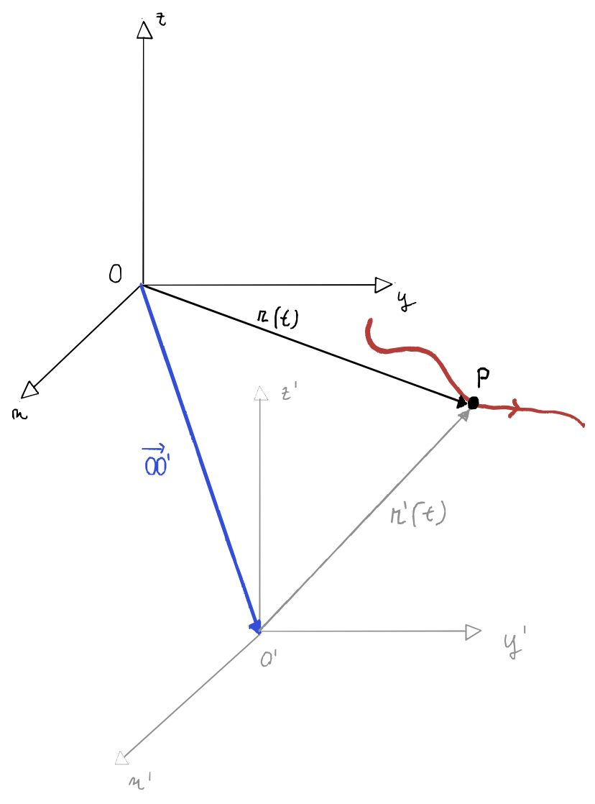
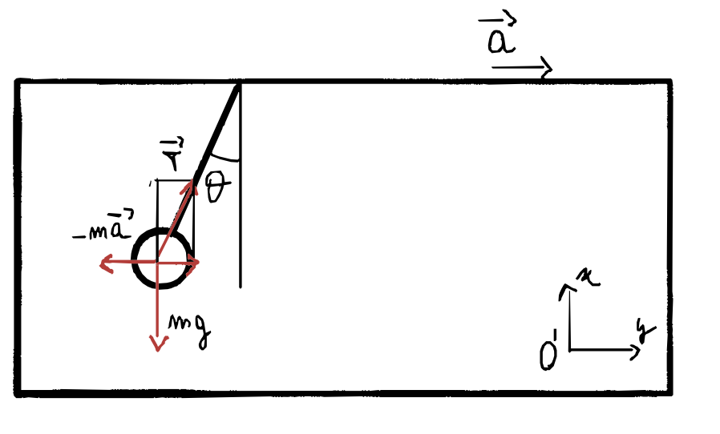

# Sistemi di riferimento
## Premesse
### Velocità angolare notazione vettoriale

Si definisce velocità angolare il vettore $\vec \omega$:

- il modulo vale $\vec \omega = \frac {d\theta}{dt}$
- la direzione è ortogonale al piano in cui giace la circonferenza
- il verso si determia tramite la regola della vite
- $\vec v = \vec \omega \times \vec r$

### Formule di Poisson
Si da per assodato senza dimostrare che:

$$
\frac {d\hat u}{dt} = \vec \omega \times \hat u
$$

con
- $\hat u(t)$ versore di un asse di riferimento che ruota
- $\vec \omega$ è il vettore velocità angolare

---
## Teorema delle velocità relative
Consideriamo due sistemi di riferimento $S$ __sistema fisso__ e $S'$ __sistema mobile__ con origine rispettivamente $O$ e $O'$. 

Il __sistema mobile__ avrà una velocità $\vec {v_{O'}}$ rispetto al sistema fisso e ruota con velocità angolare $\vec \omega$.

Troviamo ora le relazioni che esistono tra la posizione, la velocità e l'accelerazione del punto $P$ misurate da $S$ e $S'$.

Sia $\vec {OO'}$ il vettore dall'origine di $S$ all'origine di $S'$:

$$\vec r = \vec {OO'} + \vec {r'}$$
 

Abbiamo che la velocità rispetto a $S$ è:

$$\frac {d\vec r}{dt} = \frac d {dt} [z\hat x+ y \hat y + z\hat z] $$

$$=\frac {dx}{dt}\hat x + x\frac {d\hat x}{dt} + \cdots $$

ricordando che $\frac {d\hat x}{dt} = 0$ perché gli assi del sistema fisso non ruotano:

$$ 
= \frac {dx}{dt}\hat x + \frac {dy}{dt} \hat y + \frac {dz}{dt} \hat z = \vec v
$$

Ma anche a:

$$\frac {d\vec r}{dt} = \frac d {dt} (\vec {r'} + \vec {OO'}) $$

$$= \frac d{dt}\big(\vec {OO'}\big ) + \frac  {d\vec {r'}}{dt} = \vec v_{O'} + \frac  d{dt} [x'\hat{x'} + y'\hat{y'} + z'\hat{z'} ]$$

Consideriamo $\frac  {d\vec {r'}}{dt}$ 

$$
\frac  {d\vec {r'}}{dt}  = \bigg (\frac {dx'}{dt} \hat x + \frac {dy'}{dt} \hat y + \frac {dz'}{dt} \hat z\bigg) + \bigg (x' \frac {d\hat {x'}}{dt} +  y'\frac{d\hat {y'}}{dt} + z'\frac{d\hat {z'}}{dt}\bigg)
$$

in questo caso $\frac {d\hat {x}}{dt} \ne 0$ perché gli assi stanno ruotando quindi utilizzando __Poisson__

$$
\frac  {d\vec {r'}}{dt}  = \bigg ( \vec v'_{x'}\, \hat {x'} +  \vec v'_{y'}\, \hat {y'} +  \vec v'_{z'}\, \hat {z'}\bigg) + \bigg (x'  \;\vec \omega \times\hat {x'} +  y' \;\vec \omega \times\hat {y'} + z' \;\vec \omega \times\hat {z'}\bigg)
$$

$$
= \vec {v'} + \vec \omega \times \vec {r'}
$$

>Mettendo tutto insieme:
>
>$$
>\vec v = \frac {d\vec r}{dt} = \vec {v'} + \vec {v_{O'}} + \vec \omega \times \vec {r'} = \vec {v'} + \vec {v_t}
>$$
>
>Con $\vec v_t = \vec {v_{O'}} + \vec \omega \times \vec {r'}$ __velocità di trascinamento__.

###### Casi particolari:
1. il sistema mobile non ruota ($\vec \omega = 0$): __moto relativo traslatorio__ $$\vec v = \vec {v'} +  \vec {v_{O'}}$$
2. il sistema mobile non si sposta rispetto a $S$ ($ \vec {v_{O'}} = 0$), ma ruota: __moto relativo rotatorio__ $$\vec v = \vec {v'} +  \vec \omega \times \vec{r'}$$
3. se il sistema mobile non ruota e non si sposta, allora ovviamente $$\vec v = \vec v'$$

---

## Teorema delle accelerazioni relative

Deriviamo il risultato [precedente](#teorema-velocità-relative) per ottenere l'accelerazione:

$$
\vec a = \frac {d\vec v}{dt} = \frac {d \vec {v'}}{dt} + \vec a_{O'} + \vec \omega \times\frac {d\vec {r'}}{dt} + \frac {\vec \omega}{dt} \times \vec {r'}
$$

Consideriamo $ \frac {d \vec {v'}}{dt}$ che si può risolvere analogamente a [prima](#dr-primo-su-dt) diventa:

$$
\frac {d\vec {v'}}{dt} = \vec {a'} + \vec \omega\times \vec {v'}
$$

in cui $\vec {a'}$ è l'accelerazione di $P$ relativa a $S'$

Il terzo termine $\vec \omega \times\frac {d\vec {r'}}{dt}$ analogamente a [qui](#dr-primo-su-dt) diventa:

$$
\vec \omega \times\frac {d\vec {r'}}{dt} = \vec \omega \times(\vec {v'} + \vec \omega \times \vec {r'}) = \vec \omega \times\vec {v'} + \vec \omega \times(\vec\omega \times \vec {r'})
$$

> Sostituiamo:
>
> $$
> \vec a = \vec {a'} + \vec {a_{O'}} + \vec \omega \times(\vec\omega \times \vec  {r'}) + \frac {\vec \omega}{dt} \times \vec {r'} + 2\, \vec \omega\times \vec {v'}
> $$
>

> con $\vec a_t$ accelerazione di trascinamento: 
>$$\vec a_t = \vec {a_{O'}} + \vec \omega \times(\vec\omega \times \vec  {r'}) + \frac {\vec \omega}{dt} \times \vec {r'} $$
>
> in cui si hanno i contributi:
> - dell'accelerazione $\vec {a_{O'}}$ del moto di traslazione del sistema mobile
> - l'accelerazione centripeta $\vec \omega \times(\vec\omega \times \vec  {r'})$ dovuta alla rotazione del sistema mobile 
> - l'accelerazione tangenziale $\frac {\vec \omega}{dt} \times \vec {r'}$ dovuta alla variazione $\vec \omega$ cioè se il sistema mobile accelera la sua rotazione
>

> Mentre il termine 
>
> $$\vec {a_c} = 2\, \vec \omega\times \vec {v'}$$ 
>
>è detto __accelerazione complementare di Coriolis__ e dipende dal moto di $P$ rispetto al sistema mobile.

---
## Sistemi di riferimento inerziali
Un sistema di riferimento inerziale è un sistema in cui vale il primo principio della dinamica, ovvero che se un punto non soggetto a forze viene lanciato a velocità arbitraria in una qualsiasi direzione, esso si muoverà di moto rettilineo uniforme e se in quiete, rimanga in quiete.

Scelto un sistema di riferimento inerziale, ne consideriamo un altro che si muove di moto rettilineo uniforme rispetto al primo:

- $\vec v_{O'} = cost$
- $\vec a_{O'} = 0$
- $\vec \omega = 0$

Quindi dalla [formula](#accelerazioni-relative) delle accelerazioni relative si ottiene che:

$$
\vec a = \vec {a'}
$$

Quindi le accelerazioni di un punto misurate nei due sistemi di riferimento sono uguali. 

>Questo risultato indica che scelto un sistema di riferimento inerziale, tutti gli altri sistemi inerziali in moto translatorio rettilineo uniforme rispetto al primo sono anch'essi inerziali.

Quindi un esempio di sistema di riferimento inerziale?

- la Terra non è rigorosamente un sistema di riferimento inerziale, perché ruota su sé stessa e orbita attorno al Sole. Tuttavia, per molti casi di studio, considerare la Terra come un sistema inerziale _it's ok_
- il Sole non è inerziale, perché anch'esso orbita intorno a qualcosa che orbita intorno a qualcos altro che alla fiera dell'est per due soldi mio padre comprò

Un esempio di sistema di riferimento quasi-inerziale è quello con l'origine il centro di massa del sistema solare e con gli assi orientati verso determinate __stelle fisse__. È un ottima __approssimazione__ di sistema inerziale, come lo sono tutti i sistemi in moto rettilineo rispetto ad esso.

---
## Sistemi di riferimento non inerziali
Se sono solidale con un sistema di riferimento non inerziale allora la seconda legge di newton non è sempre valida:

$$
\begin{cases}
\vec F = m \vec a && S \\
\vec F = m (\vec a' + \vec {a_t} + \vec {a_c} ) && S'
\end{cases}
$$

Quindi volendo scrivere un espressione analoga alla seconda legge avremmo:

$$
\vec F' = \vec F - m (\vec a_t + \vec a_c) = m\vec {a'}
$$

Introducendo quindi le __forze apparenti__:

$$
\vec F_{app} = - m\vec a_t - m \vec a_c = -m \,\vec a_{O'} - \vec \omega \times(\vec \omega \times \vec {r'}) - m \frac {d\vec \omega}{dt} \times \vec {r'} - 2m\vec \omega \times \vec {v'}
$$

Oppure:

$$
\vec F' = \vec F - \vec F_{app} = m\vec {a'}
$$

- TODO esempio peso all'interno di un vagone in accelerazione che va contro una molla

---

## Domande


##### {{ counter }}) Cos’è un sistema di riferimento inerziale? Fanne un esempio.

Guarda [qui](#sistemi-di-riferimento-inerziali).

---


##### {{ counter }}) Cambi di sdr. Accelerazione di trascinamento, accelerazione di Coriolis.
- cambi di riferimento:
    - [velocità](#teorema-delle-velocità-relative)
    - [accelerazioni](#teorema-delle-velocità-relative)
- [accelerazione di trascinamento](#accelerazione-di-trascinamento)
- [accelerazione di Coriolis](#accelerazione-di-coriolis)

---


##### {{ counter }})  Come capisco se sono in un sdr inerziale se ho a disposizione un pendolo?

Per capire se ci troviamo in un sistema di riferimento inerziale, il pendolo a riposo è esattamente sulla verticale, cioè allineato con la direzione del campo gravitazionale.

Se ci fosse un'accelerazione del sistema, il pendolo formerebbe un angolo $\theta$ con la varticale.

Quindi avremmo:

$$\vec T + \vec P + \vec F_a = 0$$

$$
\begin{cases}
T\cdot \cos \theta = mg \\
T\cdot \sin \theta = F_a && con\ \ F_a = ma \\
\end{cases} \quad \Rightarrow\quad a = g \tan\theta
$$

---


##### {{ counter }}) Legge d’inerzia. Cos’è un sistema di riferimento inerziale? _hint: Un sistema di riferimento è inerziale se vale la prima legge della dinamica_

Vedi [qui](#sistemi-di-riferimento-inerziali).

---

