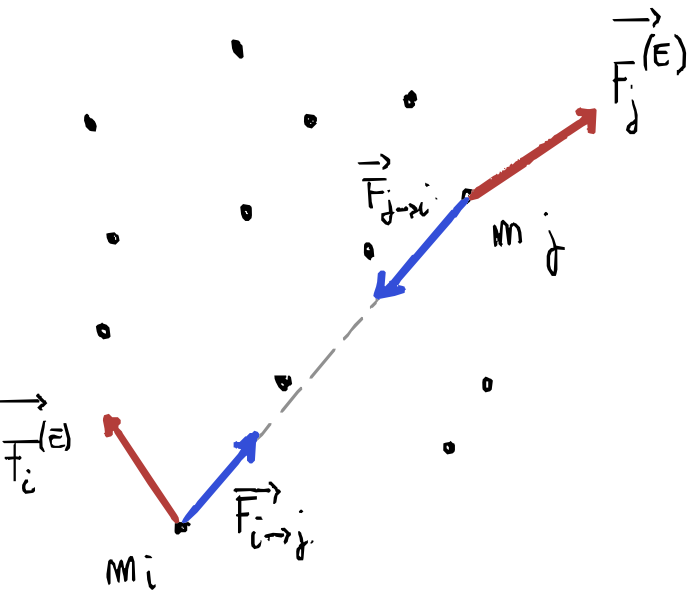

# Sistemi di punti materiali
## Punto materiale
Il punto materiale è un approssimazione in cui tutta la massa del corpo in studio si concentra in un punto. Questa approssimazione è valida quando le dimensioni del corpo sono trascurabili rispetto alle distanze in questione.

## Sistemi di punti

Consideriamo un sistema di $n$ punti materiali, la forza $\vec R_i$ agente sull'i-esimo punto si può esprimere come la risultante delle forze esterne agenti sul punto $\vec R_i^{(E)}$ e delle forze esercitate dagli altri $n-1$ punti, __forze interne__ al sistema, $\vec R_i^{(I)}$:

$$
\vec R_i = \vec R_i^{(E)} + \vec R_i^{(I)} =m_i \vec a_i
$$

Tenendo presente la [terza legge di Newton](dinamica.md#terza-legge-di-newton-principio-di-azione-e-reazione) se un punto $i$-esimo esercita una forza $\vec F_{i\rightarrow j}$ su un punto $j$-esimo allora il punto $j$-esimo esercita una forza $\vec F_{j\rightarrow i}$ sul punto $i$-esimo. Tali forze sono uguali in modulo, sono sulla stessa retta d'azione e di verso opposto.

Quindi prendendo in considerazione la risultante nel sistema di tutte le forze:
- esterne 

$$
\vec R^{(E)} = \sum_{i=1}^n \vec R_i^{(E)}
$$

- interne

$$
\vec R^{(I)} = \sum _i^n \vec R_i^{(I)} = \sum_{i=1}^n\;\; \sum _{j=1\land j\ne i} ^n \vec F_{i\rightarrow j}^{(I)} = 0
$$

|$F_{i\rightarrow j}$|$m_1$|$m_2$|$\cdots$|$m_n$|
|-|-|-|-|-|
|$m_1$|$0$|$F_{1\rightarrow 2}$ |$\cdots$| $F_{1\rightarrow n}$|
|$m_2$|$F_{2\rightarrow 1}$| $0$ | $\cdots$ | $F_{2\rightarrow n}$
|$\cdots$|$\cdots$|$\cdots$|$\cdots$|$\cdots$|
|$m_n$|$F_{n\rightarrow 1}$|$F_{n\rightarrow 2}$|$\cdots$|$0$|

Il risultato delle forze interne è zero perché in base al principio di azione e reazione esse sono a due a due uguali ed opposte, ne consegue che la risultante delle forze agenti sul sistema:

$$
\vec R = \vec R^{(E)}
$$

## Moto del centro di massa
###### Centro di massa
Si definisce __centro di massa__ di un sistema di punti materiali, il punto geometrico, nel sistema di riferimento considerato, definito dal raggio vettore:

$$
\vec r_{CM} = \frac {\sum_{i=1}^n m_i \vec r_i}{\sum _{i=1}^n m_i}
$$

le cui componenti vanno a definire le coordinate del punto:

$$
x_{CM} = \frac {\sum_{i=1}^n m_i  x_i}{\sum _{i=1}^n m_i}
$$

$$
y_{CM} = \frac {\sum_{i=1}^n m_i  y_i}{\sum _{i=1}^n m_i}
$$

$$
z_{CM} = \frac {\sum_{i=1}^n m_i  z_i}{\sum _{i=1}^n m_i}
$$

###### Teorema del moto del centro di massa
Esaminiamo $\vec R$:

$$
\vec R = \sum_{i=1}^n F_i = \sum_{i=1}^n m_i \vec a_i = \sum_{i=1}^n m_i \;\;\frac {d^2\vec r_i}{dt^2} =\frac {d^2}{dt^2}\bigg(\sum_{i=1}^n m_i \cdot \vec r_i\bigg)
$$

con $\sum_{i=1}^nm_i = M$ massa del sistema, moltiplichiamo e dividiamo per esso:

$$
\vec R = M\frac {d^2}{dt^2}\bigg(\frac {\sum_{i=1}^n m_i \cdot \vec r_i}{M}\bigg)
$$ 

con $\frac {\sum_{i=1}^n m_i \cdot \vec r_i}{M} = \vec r_{CM}$: 

>Questo esprime il teorema del centro di massa:
>
>$$
>\vec R = M \frac {d^2 \vec r_{CM}}{dt^2} = M \frac {d\vec v_{CM}}{dt} = \frac {d\vec p_{CM}}{dt}
>$$
>
> Il centro di massa si muove come un punto materiale in cui sia concentrata tutta la massa del sistema e a cui sia applicata la risultante delle forze esterne.
>
> In altre parole la risultante delle forze esterne in un sistema di punti materiali è uguale alla massa totale del sistema per la derivata seconda del centro di massa del sistema sul tempo.
>
> O ancora la risultante delle forze esterne è uguale alla derivata rispetto al tempo della quantità di moto totale del sistema 

---

## Conservazione momento in un sistema isolato

Un sistema si dice __isolato__ se 
- non è soggetto a forze __esterne__, oppure 
- l'azione delle forze esterne è tale che la loro risultante $\vec F^{(E)}$ sia nulla:

$$ \vec a_{CM} = 0,\quad \vec v_{CM} = cost,\quad \sum_i \vec p_i = cost $$

>Quindi in un sistema isolato la quantità di moto totale  del sistema rimane costante nel tempo e il centro di massa si muove di moto rettilineo uniforme o resta in quiete.

>

---

## Sistema di riferimento del centro di massa

- todo

---

## Domande


##### {{ counter }}) Terzo principio della dinamica. Se considero un sistema che prevede delle forze di reazione, mi fanno escludere a priori che il sistema sia isolato, oppure non è vero? La legge vale sempre? Quando un sistema si dice isolato?

###### a) Terzo principio della dinamica
L'enunciato della [terza legge di Newton](dinamica.md#terza-legge-di-newton-principio-di-azione-e-reazione) dice:
> - se un corpo A esercita una forza $\vec F_{A\rightarrow B}$ su un corpo B allora il corpo B eserciterà una $\vec F_{B\rightarrow A}$ uguale e contraria sul corpo A
> - le due forze hanno stessa direzione, modulo e verso opposto 
> - le due forze hanno la stessa retta d'azione (non sono solo parallele, ma sono collineari)

###### b) Quando un sistema si dice isolato?

Vedi [qui](#conservazione-momento-in-un-sistema-isolato ).

###### c)  Se considero un sistema che prevede delle forze di reazione, mi fanno escludere a priori che il sistema sia isolato, oppure non è vero? La legge vale sempre?

Possiamo considerare due casi:
- le forze di reazione sono tutte interne al sistema: non possiamo dire a priori se il sistema è isolato perché le forze interne si compensano sempre a coppie (per il terzo principio), ma per essere davvero isolato è necessario che anche le forze esterne siano nulle o si bilancino
- alcune o tutte le forze di reazione sono esterne al sistema: allora il sistema non è isolato perché perché c'è un interazione con l'esterno che può modificare la quantità di moto totale

La legge di __azione e reazione__ non vale nei sistemi non inerziali in cui sono presenti __forze apparenti__ causate da accelerazioni o rotazioni del sistema di riferimento.

Se pensiamo a una palla all'interno di una macchina, quando la macchina accelera la palla si muoverà in direzione opposta e all'interno dell'abitacolo la forza apparente che muove la palla non è contrastata da nessuna reazione, rompendo così la terza legge di Newton.