# Termodinamica
## Sistemi termodinamici
### Introduzione
Un sistema termodinamico può essere assimilato, dal punto di vista meccanico, a un sistema continuo costituito da un numero di elementi dell'ordine del __numero di Avogadro__:

$$
N_A = 6.022\cdot 10^{23}
$$

Di tale sistema si vogliono descrivere le __trasformazioni__ che può subire e gli scambi energetici ch ne derivano con l'ambiente circostante.

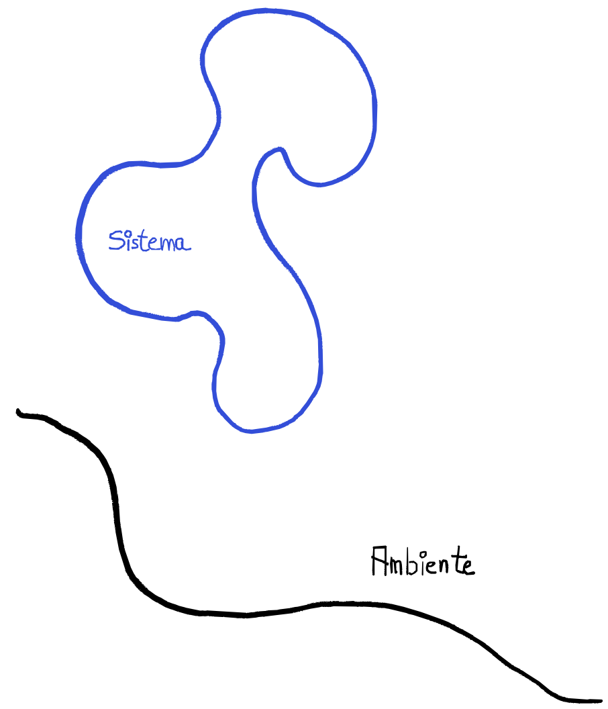

- __sistema termodinamico__ una porzione di universo che può essere costituita da una o più parti
- __ambiente__ è tutto ciò con cui il sistema può interagire
- __universo termodinamico__ è l'insieme sistema più ambiente (in senso locale)

###### Sistema aperto
Se tra il sistema e l'ambiente possono avvenire sia scambi di energia che di materia, il sistema si dice __aperto__. Una pentola posizionata sul gas per essere portata in ebbolizione, senza coperchio è un sistema aperto, perché ovviamente scambia materia (il vapore) con l'ambiente e anche energia (il calore fornito dalla fiamma)

###### Sistema chiuso
Se tra il sistema e l'ambiente possono solo avvenire scambi di energia, il sistema si dice __chiuso__. Ad esempio, mettendo il coperchio alla pentola in ebbollizione, il sistema diventa _chiuso_ (in maniera approssimata).

###### Sistema isolato
Se il sistema non può scambiare né energia né materia con l'ambiente, si dice __isolato__. Si pensi ad un termos con una bevanda calda o fredda all'interno.

>
>Ovviamente un sistema isolato è attuabile solo con una certa approssimazione. 
>
>E' isolato solo per tempi ragionevoli: non possiamo aspettarci di portare un termos con del caffè caldo in un ghiacciaio, lasciarlo lì per dieci anni e poi pretendere di trovare ancora il caffè caldo. Tuttavia, su tempi brevi, rappresenta una buona approssimazione di un sistema isolato.
>

###### Aperto, chiuso e isolato

|Definizione\Scambio|Materia|Energia|Esempio|
|-|-|-|-|
|aperto|✅|✅|🫕 senza coperchio|
|chiuso|❌|✅|🫕 con coperchio|
|aperto|❌|❌|termos|

###### Variabili termodinamiche
Per descrivere lo stato di un sistema si possono usare delle variabili macroscopiche direttamente misurabili, dette __coordinate__ o __variabili termodinamiche__ come:
- volume $V$
- pressione $p$
- temperatura $T$
- massa $m$
- densità $\rho$

Le variabili termodinamiche si dividono in:
- variabili __estensive__: descrivono una proprietà globale del sistema e sono additive (massa, volume etc)
- variabili __intensive__: descrivono una proprietà locale del sistema, proprietà che possono variare da punto a punto e non sono additive (pressione, temperature, etc)

---
### Equilibrio Termodinamico

L'esperienza sperimentale evidenzia che un sistema termodinamico lasciato libero di evolversi in assenza di azioni esterne (cioè senza interagire con l'ambiente) tende ad uno __stato di equilibrio termodinamico__ in cui le variabili termodinamiche non variano più nel tempo.

All'equilibrio le variabili termodinamiche sono dette __variabili di stato__.

>L'equilibrio termodinamico è raggiunto quando sono realizzati tutti i seguenti equilibri:
>- __equilibrio meccanico__: inteso come equilibrio di forze e momenti, prese due sottoparti $A$ e $B$ in maniera arbirtaria, tra di loro non non misuro forze
>- __equilibrio chimico__: non avvengono reazioni chimiche qualsiasi sotto parte del sistema viene presa in considerazione
>- __equilibrio termico__: la temperatura è la stessa in tutto il sistema

In uno stato di equilibrio esistono, in generale, precise relazioni tra le _coordinate_ termodinamiche, dette __equazioni di stato__, per cui non tutte le variabili sono indipendenti.

Dati due diversi stati di equilibrio termodinamico, il passaggio da uno stato all'altro si chiama __trasformazione termodinamica__ del sistema.

###### Principio _zero_ della termodinamica

> Il __principio dell'equilibrio termico__ enuncia che se due sistemi A e B sono ciascuno in equilibrio con un terzo sistema C, cioè $T_A = T_C$ e $T_B = T_C$ allora i due sistemi sono in equilibrio tra loro $T_A = T_B$.

Un metodo per portare due sistemi all'equilibrio termico è quello di metterli in contatto tramite una parete.

Se viene raggiunto l'equilibrio allora la parete viene detta __diatermica__ e i sistemi sono in __contatto termico__, se invece l'equilibrio non viene raggiunto la parete viene detta __adiabatica__ e i sistemi sono in isolamento termico (sempre ideale, ma approssimabile per tempi brevi).

Un sistema è detto __adiabatico__ se è circondato da pareti adiabatiche e quindi non può essere messo in contatto termico con l'ambiente o un altro sistema.

---
### Termometro (extra?)

---
### Calorimetria

###### Calore, calore specifico e capacità termica
Quando due corpi solidi a temperature $T_1$ e $T_2$, con $T_1 > T_2$ messi in contatto termico all'interno di un contenitore adiabatico, dopo un certo tempo $\Delta t$ essi raggiungeranno l'equilibrio termico, con una temperatura di equilibrio $T_e$ ed in particolare:

$$
T_2 < T_e < T_1
$$

Si intuisce che che tra i due corpi avviene uno scambio di energia, tale energia è detta __calore__.

>La quantità di calore $dQ$ che è necessario fornire a un corpo di massa $m$ per variare la temperatura di $dT$ è definita dalla:
>
>$$
dQ = mcdT
>$$

in cui $c$ è una grandezza caratteristica della sostanza di cui è costituito il corpo, in generale funzione a sua volta della temperatura, chiamata __calore specifico__:

> Il calore specifico rappresenta il calore che occorre scambiare con l'unità di massa di una data sostanza, alla temperatura T, per farne variare la temperatura di $1\;K = 1\;°C$.

Il prodotto 

$$C=mc$$

è detto __capacità termica__ del corpo e rappresenta il valore necessario per far variare la temperatura del corpo di $1\;K$.

Integrando:

$$
Q = \int dQ = m\int _{T_{i}}^{T_{f}} c(T)dT
$$

Spesso però il calore specifico nell'intervallo di temperatura considerato può essere considerato costante portando a:

$$
Q = mc(T_f - T_i)
$$

Quindi tornando ai due corpi in contatto termico, essi scambieranno rispettivamente $Q_1$ e $Q_2$ ed essendo il recipiente adiabatico non c'è scambio di calore con l'esterno:

$$
Q_{tot} = Q_1 + Q_2 \Rightarrow Q_1 = - Q_2
$$

> Ovvero il calore ceduto dal corpo più caldo è uguale in modulo a quello assorbito da quello più freddo.
>
>$$
m_1c_1(T_e - T_1) = - m_2c_2(T_e - T_2) 
>$$
>
> Da cui noti i calori specifici e le temperature iniziali si può calcolare la temperatura di equilibiro:
>
>$$
T_e = \frac {m_1c_1T_1 + m_2c_2T_2}{m_1c_1 + m_2c_2} = \frac {C_1T_1 + C_2T_2}{C_1 + C_2} 
>$$

Per i gas la situazione si complica un po' e si avranno calori specifici diversi a seconda delle condizioni della trasformazione (volume o pressione costanti). Questa distinzione andrebbe fatta anche per i solidi, ma la variazione di volume causate da un cambio di temperature sono piccole abbastanza da poterle trascurare.
###### Mole

In molte situazioni si preferisce utilizzare il __calore specifico molare__:

$$
c = \frac 1n \frac {dQ}{dT}
$$

Una mole di sostanza è la quantità di materia di suddetta sostanza contenente $N_A = 6.022 \cdot 10^{23}$ entità elementari (atomi o molecole). $N_A$ è il __numero di Avogadro__ che corrisponde al numero di entità fondamentali di 12 grammi di isotopo $^{12}C$  del carbonio.

La relazione tra calore specifico molare e quello dipendente dalla massa è:

$$n c^{(n)} = mc^{(m)}$$

$$c^{(n)} = \frac mnc^{(m)}$$

$$c^{(n)} = \frac {n N_Am_A}nc^{(m)}$$

$$c^{(n)} =  N_Am_Ac^{(m)}$$

---
###### Cambiamenti di fase
Sono detti __cambiamenti di fase__ i passaggi di una sostanza da uno stato di aggregazione all'altro, questi passaggi includono uno scambio di calore senza però cambiare la temperatura della sostanza.

|Cambiamento di fase|Terminologia|
|-|-|
|solido $\Rightarrow$ liquido|fusione|
|liquido $\Rightarrow$ solido|solidificazione|
|liquido $\Rightarrow$ vapore|evaporazione|
|vapore $\Rightarrow$ liquido|condensazione|
|solido $\Rightarrow$ vapore|sublimazione|
|vapore $\Rightarrow$ solido |brinamento (sublimazione)|

A __pressione costante__, la temperatura durante la solidificazione e la fusione rimane costante. L'evaporazione, invece, può avvenire a qualsiasi temperatura; un caso particolare è l'ebollizione in cui la pressione massima del vapore eguaglia la pressione esterna.
Si osserva che durante i cambiamenti di fase viene scambiata una quantità ben definita di calore a seconda della sostanza, detto __calore latente__, il calore richiesto per il cambiamento di fase:

$$Q = m\lambda$$

Il calore cambia di segno a seconda del tipo di cambiamento:
- se la sostanza __fonde__ o __evapora__, allora __assorbe__ calore
- se la sostanza __solidifica__ o __condensa__, allora __cede__ calore

###### Diagramma di fase (pT)
Un diagramma interessante sul cambiamento di fase è il diagramma tra la pressione e la temperatura.

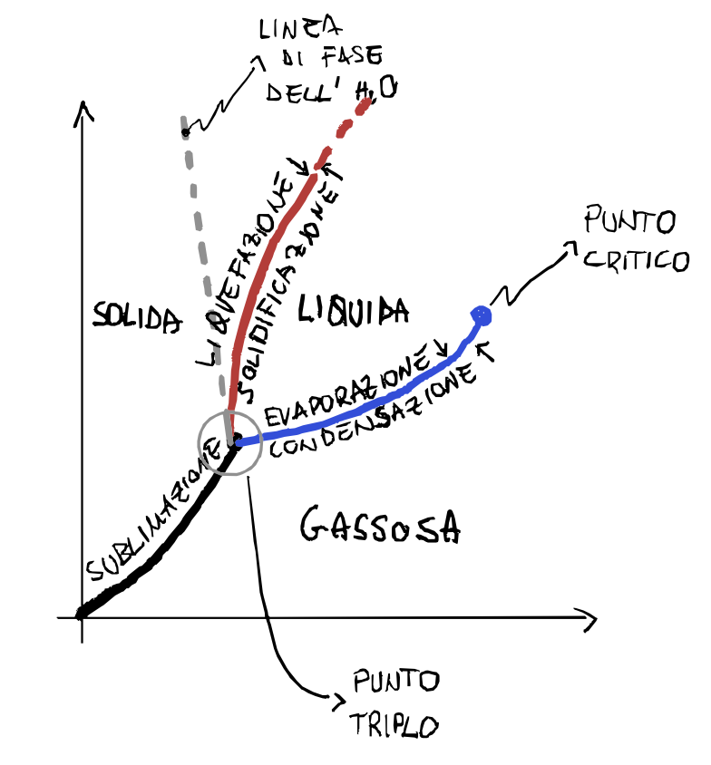

La linea di fusione/solidificazione in genere ha pendenza positiva, ciò significa che all'aumentare della pressione la sostanza ha una temperatura maggiore di fusione, fa eccezione l'acqua che invece all'aumentare della pressione la temperatura di fusione diminuisce.

Il __punto triplo__ è il punto di intersezione delle tre linee di cambio di fase. È un punto molto interessante perché possono coesistere le tre fasi contemporaneamente, cioè se una certa sostanza si trova esattamente nel punto triplo, allora avrà frazioni uguali nei tre stati di aggregazione.

Per esempio il punto triplo dell'acqua è:
- $T_{pt}=271.16\;K$
- $p_{pt}=611\;Pa$

Che definisce la scala di temperatura che usiamo, perché il punto triplo dell'acqua viene preso come punto fisso.

La linea di condensazione/evaporazione non è infinita, ma termina in un punto detto __punto critico__. 
Oltre a questo punto non è più possibile distinguere la fase liquida da quella gassosa, sono sempre compresenti, la densità del gas aumenta e quella del liquido diminuisce fino a coincidere.

###### Sorgente di calore

Si definisce __sorgente di calore__ un corpo con capacità termica molto grande (idealmente infinita), in grado di cedere o assorbire calore senza subire variazioni apprezzabili della propria temperatura.

--- 
######  Trasmissione del calore: CONDUZIONE
Consideriamo un corpo esteso in cui la temperatura non sia uniforme e tracciamo le superfici isoteerme, coiè il luogo dei punti in cui la funzione $T(x, y, z)$ assume un valore costante, per esempio $T_1$ sulla superficie $S_1$. 

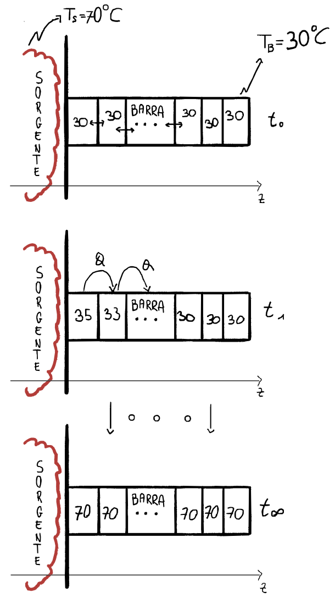

Allora la legge __fenomenologica__ che regola la conduzione del calore (legge di Fourier) è data:

$$
dQ = -k \frac {dT}{dz}dSdt
$$

- $dS$ elemento di una superficie isoterma
- $z$ l'asse perpendicolare alla superficie
- $\frac {dT}{dz}$ è il gradiente della temperatura
- $k$ detta __conducibilità termica__ con unità di misura $\frac J {m s K}$

Il segno negativo indica che il flusso di calore avviene nel senso in cui la temperatura diminuisce.
L'esistenza di un gradiente di temperatura su di un corpo (disequilibrio termico) indica che c'è una trasmissione di calore attraverso il corpo.

######  Trasmissione del calore: CONVEZIONE
Nei fluidi a contatto con una sorgente di calore, la porzione più vicina alla fonte si riscalda, aumenta di temperatura e quindi si dilata, diminuendo la propria densità.

Le masse di fluido più calde, essendo meno dense, subiscono una spinta di Archimede maggiore del loro peso e tendono a salire. Questo moto genera correnti ascensionali di convezione, che portano verso la sorgente masse di fluido più fredde.

In questo processo, il trasferimento di calore avviene insieme al movimento della materia: le porzioni di fluido più calde (con maggiore energia interna) si spostano e trasferiscono energia in altre zone, modificandone l’energia interna.

La __convezione__ è responsabile del movimento delle masse d'aria nell'atmosfera o delle correnti marine, con effetti sulle condizione climatiche e meteorologiche.

######  Trasmissione del calore: IRRAGGIAMENTO
Un corpo a temperatura T __irraggia__, ossia emette energia sotto forma di onde elettromagnetiche, che si propagano nello spazio circostante, anche se vuoto. 

Il __potere emissivo__ del corpo $ε$ è dato dalla legge di Stefan-Boltzmann:

$$
\varepsilon = \sigma e T^4 \quad \bigg[\frac J{m^2 s}\bigg]
$$

- $\sigma = 5.67\cdot 10^{-8} \;\frac J{m^2 s K^4}$ costante di Stepen-Bolztmann
- $e \in \{0,1\}$ __emissività__ se uguale a 1 la superficie è detta __corpo nero__ che a parità di temperatura presenta il massimo potere emissivo

E' attraverso l'irraggiamento che il Sole trasmette energia alla superficie terrestre:

$$ 1.37 \cdot 10^3 \;\frac W {m^2}$$

###### Vaso Dewar
Per ridurre al massimo lo scambio di calore bisogna quindi cercare di impedire il più possibile:
- conduzione 
- convezione
- irraggiamento 

Si utilizza a tale scopo un contenitore con due pareti isolanti, con in mezzo il vuoto. Questo minimizza la trasmissione di calore per conduzione e convezione.

Per annullare anche lo scambio di energia per irraggiamento, si installa una superficie argentata nelle superfici dell'intercapedine, cosicché l'irraggiamento è annullato completamente da pareti rifflettenti.

---
### Trasformazioni termodinamiche 
In una trasformazione qualsiasi gli stati intermedi possono essere di equilibrio e di non equilibrio:
- due corpi solidi con due temperature diverse messi a contatto termico raggiungeranno un equilibrio, ma tutti gli stati intermedi saranno di non equilibrio termico
- l'espansione libera di un gas, prima dell'equilibrio, tutti gli stati intermedi sono di non equilibrio perché in ogni momento ci sarà una differenza di pressione tra le parti del sistema

###### Trasformazione quasi-statica
Per cercare di ottenere una trasformazione in cui tutti gli stati intermedi siano di equilibrio, bisogna procedere con variazioni molto piccole delle variabili di stato. Quindi si fanno piccoli discostamenti dallo stato di equilibrio e si attende il ristabilirsi dell'equilibrio nelle nuove condizioni prima di procedere a un'ulteriore variazione infinitesima di stato. Una trasformazione di questo tipo viene chiamata __quasi-statica__.

La lentezza della trasformazione è condizione necessaria, ma non sufficiente per far si che gli stati intermedi siano di equilibrio, basti pensare a questi due [esempi](#trasformazioni-termodinamiche).

> ###### Trasformazioni reversibili e irreversibili
> - una trasformazione è detta __reversibile__ se essa avviene attraverso stati di equilibrio e in assenza di qualsiasi forza dissipativa;
>
> - una trasformazione è detta __irreversibile__ qualora non si svolga secondo le modalità precedenti, ossia passi attraverso stati di non equilibrio o avvenga in presenza di forze dissipative oppure si verifichino, durante il suo svolgimento, entrambe queste situazioni

---
### Lavoro Termodinamico
Consideriamo un gas all'interno di un contenitore dotato di di un pistone che è libero di muoversi con l'espandersi del gas.

Noti i valori del volume e della pressione, dall'equazione di stato possiamo ricavare la temperatura, e le trasformazioni effettuate dal sistema possono essere rappresentate nel piano di Clapeyron.

Immaginiamo un contenitore con un pistone mobile, quando il volume del gas aumenta è stato eseguito un lavoro:

$$dW = \vec F \cdot d\vec s $$

essendo la forza parallela allo spostamento

$$dW = F  ds $$

utilizzando la pressione $p = \frac F S$: 

$$dW = \frac F S S ds = pdV$$

$$
dW = pdV
$$

In una trasormazione da uno stato $A$ ad uno stato $B$, in questo caso la pressione è in funzione del volume perché non stiamo trattando più valori infinitesimi:

$$
\int _A ^B p(V) dv
$$

> Questa funzione è utile solo quando si conosce $p(V)$:
>
> - __è nota la pressione esterna__ $p$ una buona approssimazione è l'uso  della pressione esterna l'integrale è direttamente calcolabile 
> 
> $$W = p_{amb}(V_B - V_A)$$
>
> - __la trasformazione è reversibile__ e pertanto si può calcolare l'integrale, dato che la pressione è determinata in ogni stato intermedio:
>
> $$p=p_{sist}=p_{amb}$$
>
> In tutti gli altri casi questo integrale non si può applicare però:
> - se la trasformazione è __isocora__, il lavoro è sempre nullo
> - se il sistema si espande, compie un lavoro sull'ambiente (positivo)
> - se il sistema si comprime, subisce un lavoro dall'ambiente (negativo)

---
## Primo principio della termodinamica
### Esperimenti di Joule
Joule, nella metà del 1800, condusse una serie di esperimenti per mettere in relazione gli effetti termici del lavoro meccanico. In particolare, il suo obiettivo era aumentare la temperatura di una certa quantità d’acqua utilizzando procedimenti diversi:
- viene messo in rotazione un mulinello nell'acqua, il lavoro $W_1$ viene fornito dalla variazione di energia potenziale di due masse che scendono sotto l'azione della forza peso, l'acqua viene riscaldata per l'effetto dell'attrito
- viene immerso nell'acqua una resistenza R, percorsa da una corrente. $W_2$ è il lavoro speso per fare circolare la corrente
- viene compressa una certa quantità di gas, contenuta in un recipiente con pareti diatermiche, immerso nell'acqua. Il processo di compressione del gas richiede un lavoro $W_3$
- vengono strofinati tra loro due blocchi di metallo immersi nell'acqua. Il lavoro speso contro le forze d'attrito è $W_4$

Il risultato osservato da Joule e confermato da altri esperimenti, purché il sistema sia adiabatico è che indipendentemente dal tipo di lavoro meccanico, $W_1$, $W_2$, $W_3$ e $W_4$, esso è proporzionale alla variazione di temperatura dell'acqua con la stessa costante di proporzionalità.

> Sulla base delle considerazioni sull'[energia potenziale](./lavoro-ed-energia.md#energia-potenziale) vale la relazione:
>
> $$ W_{ad} = -\Delta U = U_{in} - U_{fin}$$
>
> dove $U$ è una funzione che dipende solo dalle _coordinate_ termodinamiche del sistema.

- se il sistema fornisce lavoro all'esterno $W$ è assunto positivo e pertanto l'energia $U$ diminuisce
- se invece si compie lavoro dall'esterno al sistema il lavoro $W$ è assunto negativo e l'energia $U$ aumenta

>Il calore $Q$ scambiato, senza lavoro esterno, per far variare la temperatura di $\Delta T$. di una massa d'acqua è uguale al lavoro $W_ad$ chhe deve essere speso, in condizioni adiabiatiche, per ottenere la stessa variazione di temperatura

---
### Primo principio della termodinamica. Energia interna
>Se un sistema compie una trasformazione dallo stato $A$ allo stato $B$, scambiando calore e lavoro con l'ambiente, $Q$ e $W$ dipendono dalla trasformazione che congiunge i due stati termodinamici, mentre la differenza $Q- W$ risulta indipendente dalla trasformazione:
>
> $$ \Delta U = U_B - U_A = Q - W$$
>

Questo principio quindi mostra che l'energia interna del sistema ($U_i$) aumenta se il sistema assorbe calore dall'ambiente e diminuisce se esegue lavoro sull'ambiente. Inoltre per passare da uno stato iniziale a uno finale ci sono molteplici trasformazioni possibili, quindi quantità di lavoro e calore scambiati diversi, ma che la differenza di energia interna è sempre uguale a il calore assorbito meno il lavoro eseguito dal sistema.

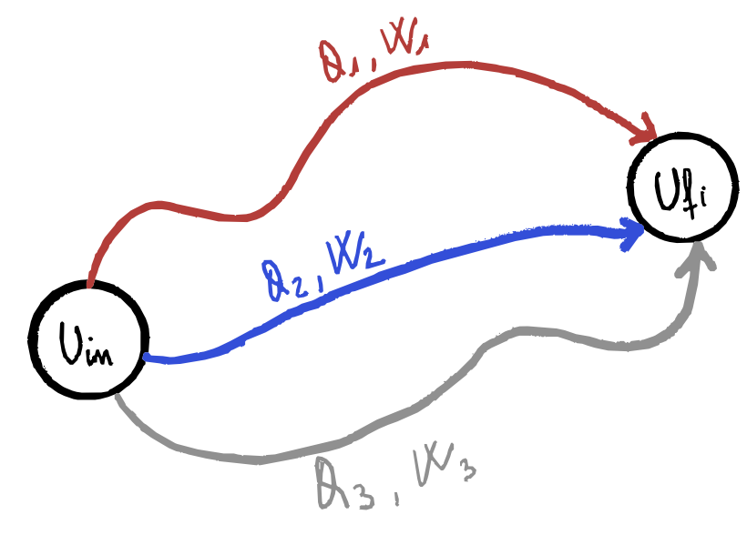

###### Osservazioni

- il primo principio della termodinamica è l'espressione del __principio generale di conservazione dell'energia__, applicato ai sistemi termodinamici: l'energia può essere trasferita sotto forma di calore e lavoro, ma la quantità totale si conserva
- __energia interna__ è tutta l'energia immagazzinata nel sistema, composta da diversi contributi quali l'energia cinetica delle molecole, l'energia potenziale delle interazioni intermolecolari, l'energia di legame, 
- nonostante il primo principio stabilisca la conservazione dell'energia, non tutta l'energia interna può essere convertita in lavoro utile; parte del calore fornito al sistema viene inevitabilmente disperso e non può essere trasformato in lavoro (questa limitazione è stabilita dal secondo principio della termodinamica)
- se lo stato iniziale coincide con lo stato finale allora la trasformazione è detta __ciclica__ e per definizione si ha che la temperatura finale coincide con quella iniziale e 

$$\Delta U = 0 \quad \Rightarrow \quad Q = W$$

- Nel calcolo infinitesimale, l'energia interna, essendo una funzione di stato, ha variazioni che sono differenziali esatti ($dU$). Al contrario, il lavoro e il calore dipendono dal percorso della trasformazione, quindi le loro variazioni infinitesime ($\delta Q$ e $\delta W$) non sono differenziali esatti

###### Convezionzione segni
Utilizzando la convenzione adottata nella formula $\Delta U = Q - W$:
- calore che entra nel sistema dall'esterno __segno positivo__
- lavoro compiuto dall'esterno verso il  sistema __segno negativo__
- lavoro compiuto dal sistema verso l'esterno  __segno positivo__
- calore che esce dal sistema verso l'esterno __segno negativo__

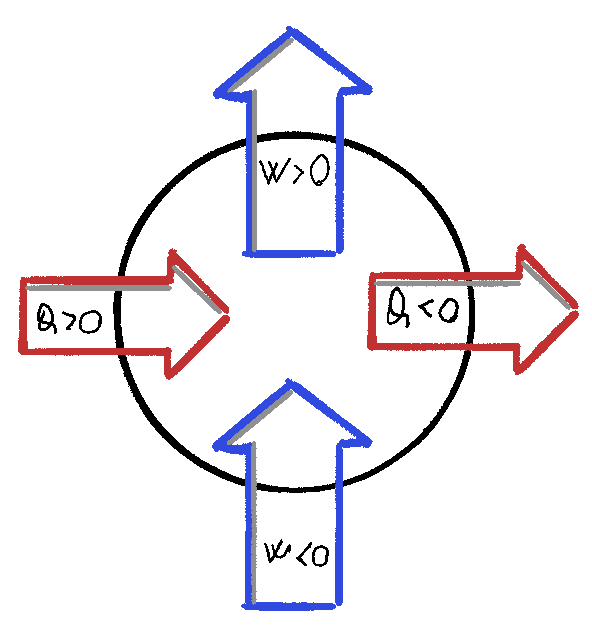

---
### Leggi dei gas ideali e trasformazioni notevoli
Si considerano gas racchiusi in un contenitore di volume $V$ con parete mobile, con valore di pressione uguale per tutti i suoi punti, le variabili per descrivere lo stato sono:
- __pressione__ $p$ è la forza per unità di superficie esercitata dal gas sulle pareti del contenitore:
$$p = \frac {\vec F_{\perp}}{S} \quad \bigg[\frac N {m^2} = Pa\bigg]$$

Se il contenitore ha una parete mobile, in equilibrio la pressione del gas $p_g$ è uguale a quella esercitata dall’ambiente $p_a$
$$\frac {F_{\perp a}}{\cancel S} = \frac {F_{\perp g}}{\cancel S} \rightarrow p_a = p_g$$

Ad esempio, in un palloncino la pressione interna del gas è bilanciata dalla forza elastica della membrana.

- __volume__ $V$ il gas non ha un volume proprio: occupa tutto lo spazio disponibile del contenitore
- __temperatura__ $T$ è legata all’energia cinetica media delle molecole del gas. Negli urti con le pareti, assumendo che queste abbiano massa molto maggiore di quella delle particelle, l’energia cinetica del gas non cambia, ma determina la pressione esercitata

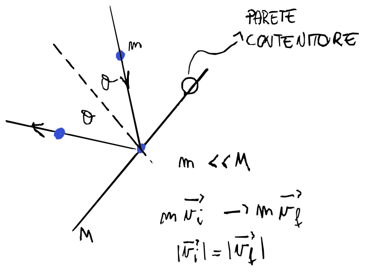

Quando un gas è sufficientemente rarefatto, si trova a bassa pressione e ad alta temperatura rispetto al punto di condensazione, può essere approssimato come gas ideale.

---
##### Legge di Boyle (trasformazioni isoterme)
La __legge di Boyle__:

$$pV = cost$$

a temperatura costante la pressione è inversamente proporzionale al volume.

Una __trasformazione isoterma__ si può realizzare utilizzando un contenitore con pareti diatermiche che sono in contatto con una sorgente di calore, una parete mobile che si muove a seguito di una differenza infinitesimale di pressione tra gas e ambiente esterno. Quindi si può supporre che gli stati intermedi siano di equilibrio. Ma anche se non fossero di equilibrio, gli stati iniziale e finale se sono alla stessa temperatura rispetteranno:

$$p_1V_1 = p_2 V_2$$

Nel piano di Claperyon, il luogo dei punti che rappresentano gli stati di equilibrio di un gas ideale a una data temperatura è costituito da un ramo di iperbole dette __isoterme del gas ideale__.

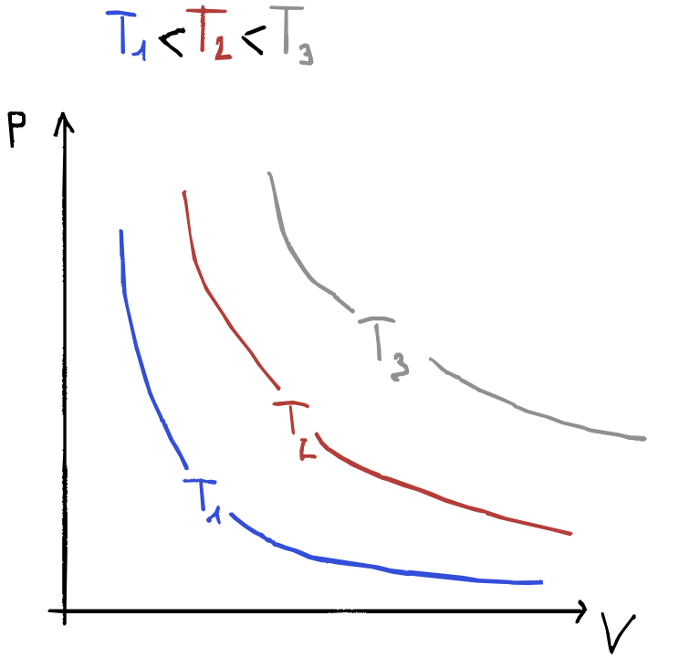

#### Legge di Volta-Gay Lussac
###### Isobara
Se la pressione del gas rimane costante, si parla di __trasformazione isobara__, il volume varia linearmente con la temperatura:

$$ V = V_0(1 + \alpha t)$$

- $\alpha$ coefficiente di dilatazione termica che varia a seconda del gas (ma di poco)
- $V_0$ è il volume quando la temperatura è $0\;°C$
- la trasformazione isobara nel piano $p$, $V$ è rappresentata da un segmenteo di retta parallelo all'asse dei volumi

Per verificare la validità della __legge isobara di Volta-Gay Lussac__ si può mettere il gas in equilibrio termico con diverse sorgenti di calore, mantenendo sempre l'equilibrio meccanico con l'ambiente (pressione gas = pressione ambiente) e ogni volta misurare il volume del contenitore che ha una parete libera di muoversi.

###### Isocora
Se invece si mantiene costante il volume di un gas allora la pressione risulta funzione lineare della temperatura:

$$ p = p_0(1 + \beta t)$$

- $\beta$ è una costante praticamente indipendente dal tipo del gas
- $p_0$ è la pressione quando la temperatura è a $0\;°C$
- la trasformazione icora nel piano $p$, $V$ è rappresentata da un segmenteo di retta parallelo all'asse delle pressioni

Per verificare la validità della __legge isocora di Volta-Gay Lussac__ si utilizza lo stesso contenitore di prima, bloccandone la parete mobile e misurando la pressione al variare della temperatura.

###### $\alpha$ e $\beta$
Più si avvicina alle condizioni per i gas ideali più $\alpha$ e $\beta$ assumono lo stesso valore:

$$\alpha = \beta = \frac 1{273.15 °C}$$

Per tanto le leggi si possono scrivere:

$$V = V_0 \cdot \alpha (\frac 1 \alpha + t) = V_0\alpha T$$
$$p = p_0 \cdot \alpha (\frac 1 \alpha + t) = p_0\alpha T$$

###### Legge di avogadro
Volumi uguali di gas diversi, alla stessa temperatura e pressione, contengono lo stesso numero di molecole oppure equivalentemente lo stesso numero di moli.

>Come conseguenza una mole di gas qualsiasi, a una data temperatura e pressione, occupa sempre lo stesso volume.
> - $n = 1\;mol$
> - $p = 1\;atm$
> - $t = 0\;°C \Rightarrow T = 273.15\;K$
> - $V_m = 22.41\;l = 0.02241\;m^3$ detto __volume molare__
>

###### Equazione di stato dei gas perfetti
Consideriamo $n$ moli di gas alla pressione atmosferica $p_0$ e alla temperatura $T_0 = 273.15\;K$ esse occupano, come appena visto, il volume $V_0 = n\cdot V_m$. Ora portiamo questo gas dallo stato A a uno stato termodinamico qualsiasi C di coordinate $p$, $V$ e $T$. Questo passaggio può essere fatto facendo una trasformazione isocora fino ad uno stato intermedio B seguito da un'isoterma a C.

- pressione nello stato B per la [legge isocora](#isocora)

$$p_B = p_0\alpha T$$

- nell'isoterma per la legge di [Boyle](#legge-di-boyle) abbiamo che:

$$pV = p_BV_0 = p_0\alpha T V_0= np_0 V_m \alpha T $$

Il prodotto 

$$p_0\alpha V_m = R  = 8.314 \frac J{mol\cdot K}$$

è detta __costante dei gas ideali__.

> Sulla base delle tre leggi elementari (Boyle, Volta-Gay Lussac) e della legge di Avogadro, definiamo quindi come gas ideale un sistema le cui coordinate termodinamiche in uno stato di equilibrio obbediscono a 
> 
> $$
> pV = n RT
> $$
>
> oppure utilizzando la costante di Boltzmann $k_b$
>
> $$
> pV = Nk_bT
> $$
>
> con $N$ numero di particelle e $n= \frac N {N_A}$
>
> - $k_B = 1.38 \cdot 10^{-23}$ è la __costante di Boltzman__ con unità di misura $\big[\frac J K\big]$
> - $R = 8.314 \cdot 10^{-23}$ è la __costante dei gas ideali__ con unità di misura $\big[\frac J {K\cdot mol}\big]$

Questo è un comportamento limite dei gas ideali: quanto più un gas è caldo e rarefatto, tanto più il suo comportamento si avvicina a quello di un gas ideale, praticamente identico per tutti i gas in tali condizioni.

---
### Calori specifici gas ideali

###### Calore specifico molare a volume costante
In una __trasformazione isocora__ dall'equazione del [calore specifico](#calore-specifico-molare):

$$dQ = nc_VdT$$

con $c_V$ __calore specifico molare a volume costante__ 

###### Calore specifico molare a pressione costante
In una trasformazione isobara possiamo calcolare il calore con il __calore specifico molare a pressione costante__:

$$dQ = n c_pdT$$

---
### Energia interna gas ideale
###### Espansione libera dei gas
La dipendenza dell'energia interna di un gas ideale dalle coordinate termodinamiche è stata ricavata analizzando il risultato dell'esperienza sull'__espansione libera__ dei gas eseguita da Joule.

In un contenitore con pareti rigide e diatermiche è diviso in due parti uguali separate da un rubinetto, a sinistra si trova il gas, mentre nella parte destra si è creato il vuoto. Questo contenitore è all'interno di un calorimetro (contenitore adiabatico pieno di liquido) e la temperatura iniziale di equilibrio è T.
Si apre il rubinetto e si lascia espandere il gas in tutto il volume a disposizione.

Sperimentalmente si osserva che indipendentemente dalla pressione del gas, aprendo lentamente o velocemente, la temperatura del calorimetro alla fine del processo è sempre la stessa $T$, temperatura iniziale di equilibrio.

Dal primo principio della termodinamica applicato a tutto il sistema:

$$\Delta U = \Delta U _{gas} + \Delta U_{cal} = Q - W = 0$$

In quanto l'intero sistema non scambia ne lavoro ne calore con l'ambiente. D'altra parte lo stato del liquido del calorimetro è lo stesso di quello iniziale, per cui la sua energia non è cambiata, ne segue che nell'espansione libera l'energia interna di un gas non varia ed essendo solo la temperatura la costante, si può dedurre che 

> l'energia interna deve essere funzione soltanto della temperatura

Risultato vero solo per un gas ideale.

---
### Trasformazioni notevoli
###### Trasformazioni isocore

Il volume rimane costante quindi il lavoro in questa trasformazione è nullo:

$$V = cost \quad \Delta V = 0\quad W = 0$$

$$dU = \delta Q - \delta W = \delta Q - 0$$

Ricordando che il calore si calcola con il [calore specifico](#calore-specifico-molare):

$$dQ = mc^{(m)}\Delta T\quad \mathtt{calore\;specifico}$$ 

$$dQ = nc^{(n)}\Delta T\quad \mathtt{calore\;specifico\;molare}$$ 

Quindi posso il calore che scambio sarà uguale:

$$dQ = nc_VdT$$

Essendo appunto il lavoro nullo si ottiene che la variazione di energia interna sarà uguale al calore scambiato:

$$dU = nc_VdT$$

>Questo è un risultato importante perché $U = U(T)$ è una funzione di stato e dipende solo dalla temperatura, allora la relazione che abbiamo appena trovato è universalmente valida per calcolare l'energia interna
>
>$$\Delta U = nc_V\Delta T$$
>

Dalla [teoria cinetica](#teoria-cinetica-dei-gas):
- gas monoatomici $\frac 32 R$
- gas biatomici $\frac 52 R$

---
###### Trasformazioni isobare

In una trasformazione isobara la pressione è costante:

$$p=cost \quad \Delta p = 0$$

Ricordando l'equazione di stato dei gas si ottiene:

$$
p = \frac {nRT}{V} = cost \quad 
$$

Dal primo principio della termodinamica:

$$dU = dQ - dW$$

Il __lavoro__ sarà l'area sottesa della trasformazione (un rettangolo essendo la pressione costante)

$$dW = pdV = \frac{nRT}{V}dV$$

Essendo anche $pdV = nRdT$ perché a piccole variazioni di volume si hanno piccole variazioni di temperatura (tutto il resto è costante) si ottiene:

$$\frac{nRT}{V}dV = nRdT$$

Il calore in questo caso si calcolerà con il calore specifico molare a pressione costante:

$$dQ = nc_PdT$$

La variazione di energia interna si può utilizzare il risultato dalle isocore:

$$dU = nc_VdT$$

Mettendo insieme la prima legge della termodinamica 

$$dU = \delta Q - \delta W$$ 

si ottiene la relazione di Mayer:

###### Relazione di Mayer

$$\cancel nc_V\cancel{dT} = \cancel nc_p\cancel{dT} - \cancel nR\cancel{dT} \quad \Rightarrow \quad R = c_p - c_V$$
Questa relazione, nota come relazione di Mayer, esprime la differenza tra il calore specifico a pressione costante e quello a volume costante per un gas ideale.

È utile anche introdurre il parametro adimensionale:

$$\gamma = \frac {c_p}{c_v} > 1$$

detto rapporto dei calori specifici, fondamentale nello studio dei gas ideali, in particolare nei processi adiabatici.

---
###### Trasformazioni isoterme
Nelle trasformazioni isoterme abbiamo:

$$T = cost \quad \Delta T = 0$$

Per le trasformazioni isoterme non abbiamo modo di calcolare il calore scambiato, ma sappiamo, grazie all'equazione di stato dei gas ideali:

$$pV = cost = nRT\quad \Rightarrow \quad p = \frac {nRT}V = \frac {cost}V$$

Quinid il lavoro:

$$W = \int_i^fpdV = \int_i^f\frac {nRT}V dv = nRT\bigg[\ln \bigg(\frac {V_f}{V_i}\bigg)\bigg]$$

Essendo __isoterma__ ha $\Delta U = 0 = Q - W$:

$$\Delta U = 0 \Rightarrow Q = W = nRT \ln \bigg(\frac {V_f}{V_i}\bigg)$$

Non ha senso di parlare di calore specifico a temperatura costante perché sarà sempre uguale a zero essendo $dt = 0$

---
###### Trasformazioni adiabatiche
Il calore scambiato in un adiabatica è sempre nullo:

$$dQ = 0$$

Il gas è all'interno di un contenitore a pareti adiabatiche quindi può scambiare solo lavoro per esempio tramite una parete mobile, consideriamo una trasformazione da uno stato A a uno stato B:

$$
W_{AB} = - \Delta U = n c_V (T_B - T_A)
$$

Si utilizza l'equazione di stato per le temperature:

$$
T_A = \frac{p_AV_A}{nR} \quad T_B = \frac{p_BV_B}{nR}
$$

E si utilizza la relazione di Mayer con $\gamma = \frac{c_p}{c_V}$

$$R = c_p - c_V \Rightarrow \frac {c_V}{c_p - c_V} = \frac 1 {\gamma - 1}$$

Sostituendo

$$
W_{AB} = \frac 1 {\gamma - 1}(p_BV_B - p_AV_A)
$$

>- se si ha un'_espansione adiabatica_ il lavoro è positivo e $\Delta U < 0$ quindi il gas si raffredda
>
>$$T_A < T_B$$
>
>- se si ha una _compressione adiabatica_ il lavoro è negativo e $\Delta U > 0$ quindi il gas si riscalda
>
>$$T_A > T_B$$

Se la __trasformazione__ è __adiabatica reversibile__:

$$dQ = dU + dW = nc_VdT + pdV = 0$$

inoltre si può utilizzare l'equazione di stato in ogni stato intermedio (perché la trasformazione è reversibile) per esprimere la pressione:

$$nc_VdT + \frac {nRT}{V} dV = 0$$

Separiamo le variabili e utilizziamo la relazione di Mayer

$$(\gamma - 1) \frac {dv}V = -\frac{dT}T$$
Integrando:

$$(\gamma - 1) \ln\bigg(\frac {V_B}{V_A}\bigg) = -\ln\bigg(\frac {T_B}{T_A}\bigg)\quad\quad\,\, $$

$$\Downarrow$$

$$T_BV_B^{\gamma - 1} = T_AV_A^{\gamma -1}$$

Tramite l'equazione di stato si può trasformare la relazione tra $T$ e $V$ in una tra $p$ e $V$ 

$$pV^\gamma = cost$$

o tra $p$ e $T$:

$$pT^{\frac {1 - \gamma}{\gamma}} = cost$$

Se rappresentiamo la trasformazione nel piano di Clapeyron utilizzando $pV^\gamma = cost$ e confrontandola con un __isoterma__ $pV = cost$, avremo due curve simili, ma la curva adiabatica sarà più ripida perché $\gamma > 1$.

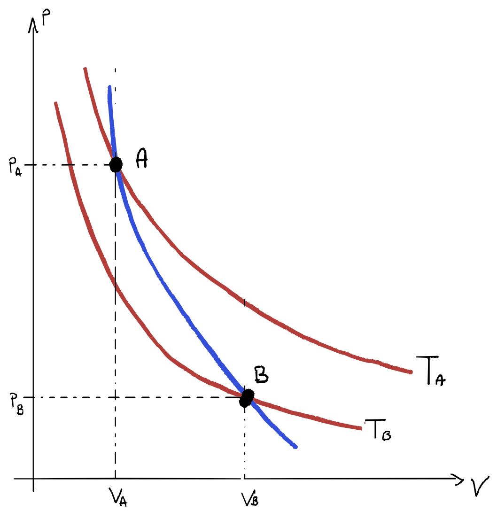

---
### Trasformazioni Generiche

$$d Q = nc_VdT + pdV$$

---
### Trasformazioni cicliche
Una trasformazione ciclica è quella trasformazione in cui lo stato finale coincide con lo stato iniziale, di conseguenza in un ciclo $\Delta U = 0$ e $Q = W$, il lavoro scambiato coincide con il calore scambiato.

- se duratnte la trasformazione viene prodotto lavoro ($W>0$) assorbendo complessivamente calore da un numero opportuno di sorgenti, allora il dispositivo si dice __macchina termica__

- se durante la trasformazione viene richiesto lavoro esterno ($W<0$), cedendo complessivamente calore a un opportuno numero di sorgenti, allora il dispositivo si dice __macchina frigorifera__

Siano:
- $Q = Q_A + Q_C$
    - $Q_A > 0$ somma dei calori assorbiti
    - $Q_C < 0$ somma dei calori ceduti
- $W = W_F + W_S$
    - $W_F < 0$ somma dei lavori compiuto
    - $W_S > 0$ somma dei lavori subiti

> Il rendimento $\eta$ di una macchina termica è definito come il rapporto tra il lavoro fornito e la quantità di calore assorbito:
>
>$$\eta = \frac {W}{Q_A} = \frac {Q_A + Q_C}{Q_A} = 1 + \frac {Q_C}{Q_A} = 1 - \bigg|\frac {Q_C}{Q_A}\bigg|$$
>
>Sperimentalmente si osserva sempre che 
>
>$$0 \le \eta < 1$$
>
>$$W<Q_A \quad |Q_C| < Q_A \quad Q_C \ne 0$$ 

#### Ciclo di carnot
Il ciclo di carnot è diviso in quattro trasformazioni:
1. trasformazione $AB$: __espansione isoterma__ reversibile alla temperatura $T_2$
2. trasformazione $BC$: __espansione adiabatica__ reversibile
3. trasformazione $CD$ __compressione isoterma__ reversibile alla temperatura $T_1$
4. trasformazione $DA$: __compressione adiabatica__ reversibile

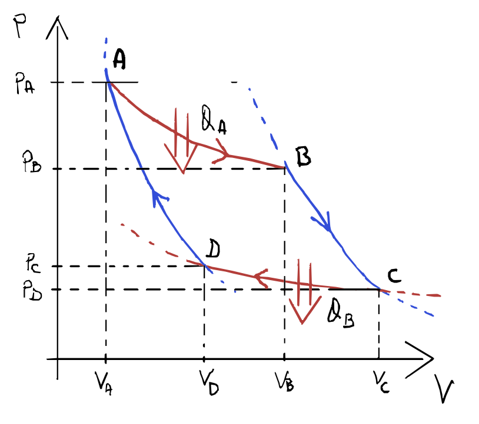

###### 1) A$\rightarrow$B _ESPANSIONE ISOTERMA A $T_2$_

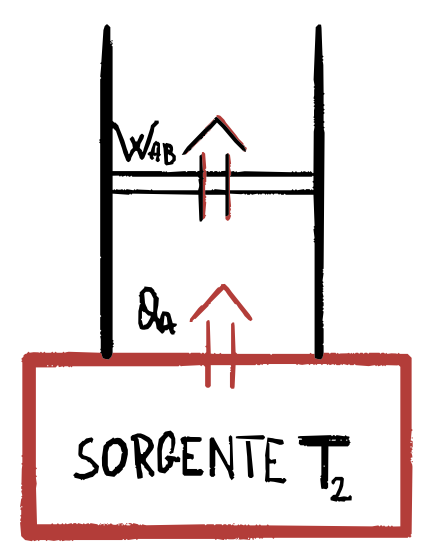

Il gas durante questa trasformazione è in equilibrio termico con una sorgente di calore a temperatura $T_2$, il gas passa:
- dallo stato $A$ di coordinate $p_A, V_A, T_2$
- allo stato $B$ di coordinate $p_B, V_B, T_2$
assorbendo il calore:

$$Q_{A} = nRT_2 \ln\bigg(\frac {V_B}{V_A}\bigg) = W_{AB}$$

###### 2) B$\rightarrow$C _ESPANSIONE ADIABATICA_

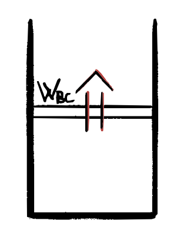

Essendo una trasformazione adiabatica, il gas è isolato da ogni srogente di calore per cui esso passa: 
- dallo stato $B$ di coordinate $p_B, V_B, T_2$
- allo stato $B$ di coordinate $p_C, V_C, T_1$

con $T_2 > T_1$ e 

$$\Delta U = Q_{BC} - W_{BC} = 0 - W_{BC}$$ 

$$\Downarrow$$

$$W_{BC} = - \Delta U = -nc_V(T_1 - T_2) = nc_V(T_2-T_1)$$

###### 3) C$\rightarrow$D _COMPRESSIONE ISOTERMA_

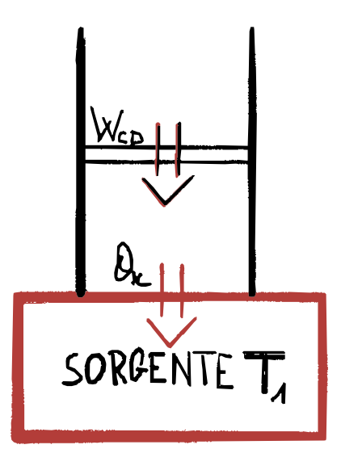

Analogamente alla A$\rightarrow$B, in questa trasformazione il gas è in contatto con una sorgente di calore a temperatura $T_1$, ma il gas viene compresso, il calore ceduto:

$$Q_{C} = nRT_1 \ln\bigg(\frac {V_D}{V_C}\bigg) = W_{CD}$$

Che è negativo come il lavoro perché $V_C > V_D$.

###### 4) C$\rightarrow$D _COMPRESSIONE ADIABATICA_

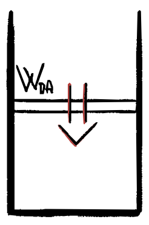

Analogamente alla B$\rightarrow$C, in questa trasformazione il gas è isolato da ogni fonte di calore, il calore scambiato è nullo e il lavoro corrisponde a:

$$W_{DA} = - \Delta U = -nc_V(T_2 - T_1) = nc_V(T_1-T_2) = -W_{BC}$$

##### Rendimento ciclo di Carnot

- $$Q = Q_A + Q_C = W = W_{AB} + W_{BC} + W_{CD} + W_{DA} = W_{AB} + W_{CD}$$
- $$\eta = 1 + \frac {Q_C}{Q_A} = 1 + \frac {T_1 \ln \frac {V_D}{V_C}}{T_2 \ln \frac {V_B}{V_A}} = 1 - \frac {T_1 \ln \frac {V_C}{V_D}}{T_2 \ln \frac {V_B}{V_A}} $$

Sapendo che per le trasformazioni adiabatiche vale:

$$T_2{V_B}^{\gamma-1} = T_1{V_C}^{\gamma-1}$$

$$ T_2{V_A}^{\gamma-1} = T_1{V_D}^{\gamma-1}$$

Dividendo membro a membro si ottiene che:

$$\frac {V_B}{V_A} = \frac {V_C}{V_D} \quad \Rightarrow \quad \ln \frac {V_B}{V_A} = \ln \frac {V_C}{V_D}$$

Quindi il rendimento diventa:

$$\eta = 1 - \frac {T_1}{T_2}$$

In quest'ultima equazione si nota il fatto che non compare nessuna grandezza caratteristica del gas, ma solo i valori delle temperature delle sorgenti con cui il gas scambia calore.

> Il rendimento del ciclo di Carnot, compiuto da un gas ideale, dipende solo dalle temperature a cui avvengono gli scambi isotermi di calore.

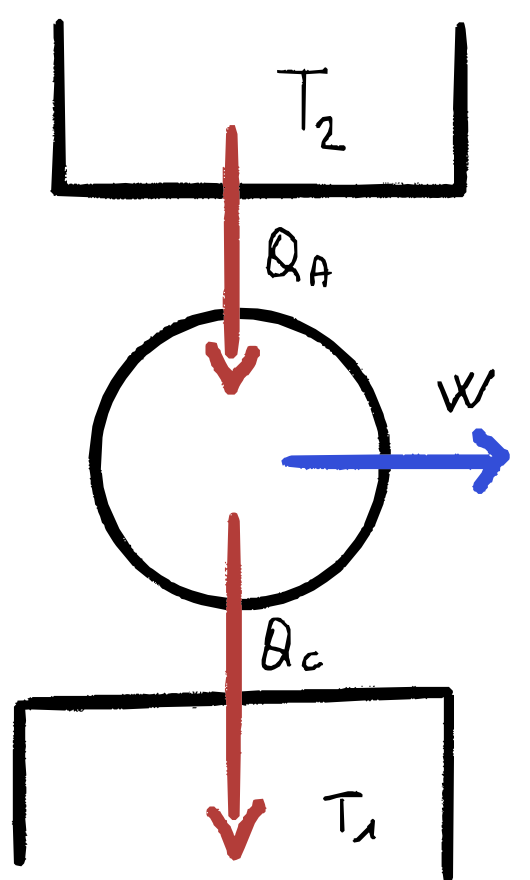

###### TODO
- ciclo frigorifero (carnot al contrario)

---
### Teoria cinetica dei gas
Consideriamo un contenitore cubico dal lato $l$ con all'interno un gas ideale:
1. gli urti tra le molecole e la parete sono considerati urti elastici con angoli di incidenza uguali
2. la massa della parete è molto maggiore rispetto a quella delle singole molecole quindi le consideriamo fisse durante gli urti

Quando una molecola urta contro la parete perpendicolare all'asse $x$, la quantità di moto varia solo per la componente $x$:

$$\Delta p = m(\vec {v'} - \vec v) = m(\vec {v_x}' - \vec v_x) = -2m\vec{v_x}$$

Quindi l'impulso trasferito alla parete è:

$$2mv_x$$

La particella inoltre impiegherà un tempo $\Delta t$ per scontrarsi di nuovo con la stessa parete:

$$\Delta t = \frac{2l_x}{v_x}$$

quindi la forza che agisce lungo la parete:

$$\vec F_x = \frac {\Delta \vec p}{\Delta t} = \frac {2m\vec v_x v_x}{2l_x}$$

eliminando la notazione vettoriale perché siamo sulla $x$

$$F_x = \frac {\Delta p}{\Delta t} = \frac {m{v_x}^2}{l_x}$$

Ora vogliamo trovare la forza totale sempre su quella parete causata da tutte le particelle:

$${F_x}^{tot} = \frac m{l_x}\sum_{i=1}^N  {v_{x\,i}}^2$$

possiamo considerare la media delle velocità $\langle v_x^2 \rangle$

$${F_x}^{tot} = N\frac {m}{l_x} \langle{v_x}^2\rangle$$

dividendo per la superficie entrambi i membri ottengo la definizione di pressione per la parete ortogonale a x

$$p_x=\frac{F_x^{tot}}{l_z l_y} = N\frac m{l_x l_z l_y}\langle{v_x}^2\rangle = N\frac mV\langle{v_x}^2\rangle $$

Ma sapendo che la pressione deve essere uguale per ogni parete otteniamo che:

$$p = p_x = p_y = p_z$$

$$\langle{v_x}^2\rangle = \langle{v_y}^2\rangle = \langle{v_z}^2\rangle$$

$$\langle \vec v^2 \rangle = \langle \vec v_x^2 \rangle +  \langle \vec v_y^2  \rangle +  \langle \vec v_z^2  \rangle$$

$$ \langle \vec v_x^2 \rangle =  \langle \vec v_y^2  \rangle =  \langle \vec v_z^2  \rangle = \frac {\langle \vec v^2  \rangle}3$$

Quindi otteniamo:

$$pV = \frac {2N}3\big\langle{\frac 12m{v_x}^2}\big\rangle = \frac {2N}3\big\langle{E_k}\big\rangle$$

ma sapendo che 

$$pV = Nk_B T$$

otteniamo che 

$$Nk_B T = \frac {2}3 N\big\langle{E_k}\big\rangle$$

da cui

$$\langle{E_k}\big\rangle = \frac 32 k_B T$$

>L'energia cinetica media delle molecole che compongono un gas ideale è direttamente proporzionale alla temperatura assoluta del gas, con costante di proporzionalità $\frac{3}{2}k_B$. Questo risultato fondamentale della teoria cinetica stabilisce il legame microscopico tra il moto delle particelle e la temperatura macroscopica del sistema.
> 
> Inoltre in questo modello non ci sono energia del gas ideale è dovuta solo ed esclusivamente al movimento delle sue particelle (in questo modello non ci sono energie potenziali o attrazioni tra le molecole) quindi:
>
> $$U = N \langle E_k \rangle $$
>
> $$U = \frac 32N k_BT $$
>
> ovvero l'energia è funzione solo della temperatura, come sperimentato nell'[espansione libera dei gas ideali](#espansione-libera-dei-gas), in questo caso però questo risultato deriva da un modello.
>

#### Gradi di libertà:
Il fattore $\frac{3}{2}$ deriva dal fatto che le molecole possono muoversi nelle tre dimensioni spaziali, avendo quindi 3 gradi di libertà traslazionali.
Secondo il teorema di equipartizione dell'energia, ogni grado di libertà quadratico contribuisce con $\frac{1}{2}k_B T$ all'energia media:

- 3 gradi di libertà traslazionali → $3 \times \frac{1}{2}k_B T = \frac{3}{2}k_B T$

Questo numero può cambiare per molecole più complesse:

###### Gas monoatomico (He, Ar): 
solo traslazione → $f = 3$ → $\langle E \rangle = \frac{3}{2}k_B T$

###### Gas biatomico (N₂, O₂):

3 gradi traslazionali + 2 gradi rotazionali → $f = 5$ → $\langle E \rangle = \frac{5}{2}k_B T$

### Trasformazioni Reversibili e Irreversibili
Una trasformazione è detta __reversibile__ se è possibile riportare allo stato iniziale sia il sistema che l'ambiente esterno.

###### Esempi irreversibili
1. __presenza attriti__: il calore che il gas ha assorbito viene speso per effettuare il lavoro (espansione del gas), ma anche per gli attriti (ad esempio attrito del pistone con il cilindro) quindi se voglio riportare il gas allo stato iniziale dovrò spendere un lavoro per la compressione uguale al calore assorbito meno il calore perso nell'attrito

    - espansione $$Q_{gas} = W_{espansione} + W_{attriti}$$ con $$W_{attriti} = Q_{ambiente}$$
    - compressione $$W_{compiuto} = Q_{gas} - Q_{ambiente} < Q_{gas}$$
si vede quindi che il calore ceduto all'ambiente a causa dell'attrito non è recuperabile durante la compressione.

2. __espansione libera__: in questo caso non c'è ne lavoro, ne calore scambiati, ma per riportare il sistema allo stato originale devo operare una trasformazione inversa, cioè una compressione isoterma in cui il lavoro sarà uguale al calore e sarà diverso da zero

3. due corpi a contatto in un sistema isolato a temperature differenti a contatto termico dopo un certo tempo saranno in equilibrio termico, per poi riportarli alla situazione iniziale dovrò introdurre almeno una macchina frigorifera nel sistema

---
## Secondo principio della termodinamica
Il primo principio della termodinamica afferma che:

$$ \Delta U = Q - W$$

In un ciclo termodinamico, $\Delta U = 0$, tutto il calore si trasforma in lavoro:

$$W = Q$$

Tuttavia, in una macchina termica che scambia calore con due sorgenti ($T_2 > T_1$), il calore ceduto alla sorgente $T_1$ $Q_C <0$ non è mai nullo, pertanto:

$$W= Q_A + Q_C \Rightarrow W < Q_A$$

Se invece consideriamo una trasformazione non ciclica, è possibile convertire tutto il calore assorbito in lavoro, ma questo non è mai l'unico effetto: cambia lo stato del sistema. Per esempio, nell'__espansione isoterma__ di un gas ideale:

$$Q = W$$

ma le coordinate termodinamiche sono cambiate:

$$(V_i,\;p_i) \quad \rightarrow \quad (V_f > V_i,\;p_f < p_i)$$

e per riportare il gas allo stato iniziale occorre cedere calore.

Inoltre, il calore non fluisce mai spontaneamente da un corpo freddo a un corpo più caldo (può avvenire con l'ausilio di una macchina frigorifera).

Queste due evidenze sperimentali:
1. _impossibilità di trasformare tutto il calore assorbito in lavoro_
2. _impossibilità di far fluire calora da un corpo freddo a uno caldo spontaneamente_
hanno portato alla formulazione del __secondo principio della termodinamica__.

### Enunciati secondo principio della termodinamica
###### Enunciato di Kelvin-Planck
> È impossibile realizzare un processo che abbia come __unico__ risultato la trasformazione in lavoro del calore fornito da una sorgente a temperatura uniforme

###### Enunciato di Clausius
> È impossibile realizzare un processo che abbia come __unico__ risultato il trasferimento di calore da un corpo a un altro ad una temperatura maggiore.

##### Equivalenza Enunciati
###### $\neg {KP} \Rightarrow \neg {C}$
Supponiamo esista una macchina che viola $KP$, convertendo completamente il calore $Q_A$ assorbito da una sorgente calda in lavoro $W=Q_A$.

Accoppiamo questa macchina $\cancel {KP}$ a una macchina frigorifera che usa tutto il lavoro fornito per trasferire calore da una sorgente $T_L$ alla sorgente $T_H$.
Allora inseriamo un nuovo processo frigorifero che sfrutta il lavoro della macchina termica per portare il calore $Q_1$ da una sorgente fredda ad una calda $Q_2$

- $Q_A = W$ perché non viene ceduto alcun calore
- $Q_2 = W + Q_1 = Q_A + Q_1$
- $Q_2 > Q_A$

Quindi se raggruppiamo questi due processi otteniamo una macchina che fa fluire calore dalla sorgente fredda a quella calda come unico effetto, non produce lavoro (il lavoro è interno al nuovo sistema) e altro non è che la negazione di __Clausius__.

In alternativa si potrebbe anche utilizzare il lavoro generato dalla macchina $\cancel {KP}$ per eseguire una compressione isoterma

$$W_{\cancel {KP}} = nRT_2 \ln \frac {V_f}{V_i}$$

vogliamo che $T_2 > T_H$

$$\frac {W_{\cancel {KP}}}{nR\ln V_f/ V_i} > T_H$$

ad una temperatura $T_2> T_H$ quindi cedendo calore ed ottenendo nuovamente $\cancel C$. 

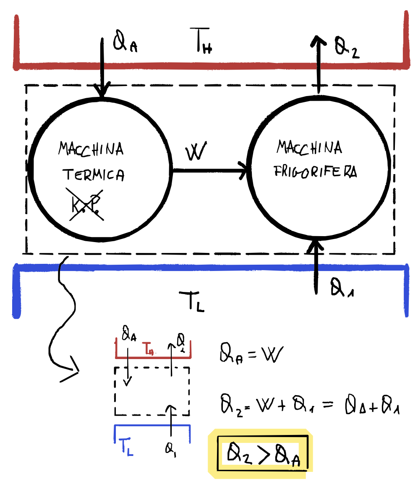

###### $\neg {C} \Rightarrow \neg {KP}$

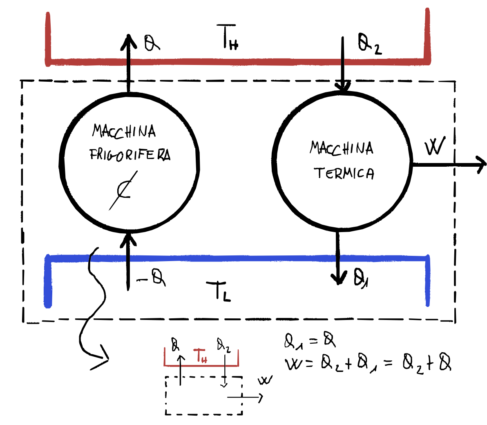

---
### Teorema di carnot
Consideriamo due macchine generiche che lavorano tra due sorgenti di calore con

$$T_2 > T_1$$

Indichiamo le due macchine con i simboli $R$ e $X$: la prima è una macchina reversibile, mentre la seconda è una macchina generica.

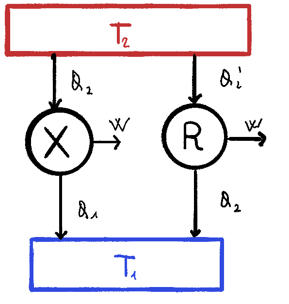

I rendimenti delle due macchine sono rispettivamente:

$$\eta_R = \frac W {Q_2'} \quad  \eta_X = \frac W {Q_2}$$

Per assurdo assumiamo che il rendimento della macchina generica sia maggiore di quella reversibile 

$$\eta_X > \eta_R$$

Sapendo che $R$ è reversibile, possiamo invertire il ciclo e renderla una macchina frigorifera che prende il lavoro fornito da $X$ per scambiare calore tra le sorgenti.

Ora consideriamo la macchina $M$ che raggruppa insieme $X$ e $\overline R$. 

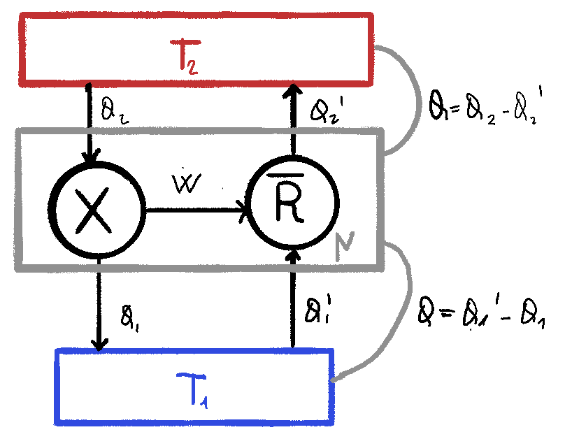

Sapendo che per ipotesi

$$\eta_X > \eta_R$$

$$\frac {\cancel W} {Q_2} > \frac {\cancel W} {Q_2'} \Rightarrow Q_2 < Q_2' $$

Questo significa che il calore nella macchina $M$ dalla sorgente più calda è negativo, il che significa che il calore fluisce dalla sorgente fredda a quella calda: essendo l'__unico__ effetto della macchina $M$ questa viola l'enunciato di Clausius, assurdo, quindi otteniamo che 

$$\eta_X \le \eta_R$$

Se assumiamo ora $X$ reversibile ed effettuando gli stessi passaggi otteniamo analogamente al caso precedente:

$$\eta_{X}^{rev} \ge \eta_R$$

resa compatibile con il caso precedente otteniamo quindi:

$$\eta_{X}^{rev} = \eta_R$$

> - tutte le macchine reversibili che lavorano tra le stesse sorgenti alle temperature $T_1$ e $T_2$ hanno rendimento uguale;
> - qualsiasi altra macchina che lavori tra le stesse temperature non può avere rendimento maggiore;
> - il risultato è indipendente dal particolare sistema che compie il ciclo

- l'ultimo corollario afferma che tutte le macchine termiche che lavorano tra due sorgenti hanno lo stesso rendimento; quindi possiamo considerare il rendimento del ciclo di Carnot, valido per ogni macchina reversibile che lavora tra $T_1$ e $T_2$

$$\eta = 1 - \frac {T_1}{T_2}$$

- un'altra formulazione detta __diseguaglianza di Clausius__ è (utile per l'entropia)

$$1 - \frac {|Q_1|}{Q_2} \le 1 - \frac {T_1}{T_2}$$ 
$$Q_1 < 0 \Rightarrow Q_1 = -|Q_1|$$ 
$$\frac {Q_1}{T_1} + \frac {Q_2}{T_2} \le 0$$ 

- questo rendimento esprime un limite massimo e fa notare che più distanti sono le temperature più alto è il rendimento

- nel momento in cui la macchina è reversibile $$-\frac {|Q_1|}{T_1} + \frac {|Q_2|}{T_2} = 0 \Rightarrow \frac {|Q_1|}{T_1} = \frac {|Q_2|}{T_2}  $$ 
questo fornisce un legame diretto tra i calori scambiati e le temperature delle sorgenti: 

---
### Teorema di Clausius
Partendo dalla formulazione del teorema di Carnot

$$\frac {Q_1}{T_1} + \frac {Q_2}{T_2} \le 0$$ 

Consideriamo una trasformazione ciclica generica.

E andiamo ad approssimare il ciclo con trasformazioni isoterme e adiabatiche.

analizzando un pezzettino di ciclo andiamo a completare a coppie una isoterma e una adiabatica per formare tanti piccoli cicli di Carnot.

Sappiamo che per ogni ciclo vale:

considerando che segmenti interni delle adiabatiche hanno calore 0 e le isoterme vengono percorse nei due sensi si possono andare ad eliminare tutti i segmenti percorsi due volte andando a lasciare solo le trasformazioni esterne

andando a fare trasformazioni infinitesime andiamo ad ottenere:

---
### Entropia
Il teorema di Clausius afferma che

$$\oint \frac {dQ}T \le 0 \quad (= 0 \; se\; rev)$$

Scegliamo due punti arbitrari in un ciclo reversibile si ottiene

$$\int_A^B {\frac {dQ}T}_{(I)} + \int_B^A {\frac {dQ}T}_{(II)} = 0$$

Essendo reversibile posso considerare il percorso ($II$) inverso:

$$\int_A^B {\frac {dQ}T}_{(I)} - \int_A^B {\frac {dQ}T}_{(II)} = 0$$

ottenendo che 

$$\int_A^B {\frac {dQ}T}_{(I)} = \int_A^B {\frac {dQ}T}_{(II)}$$

È importante notare l'arbitrarietà dei percorsi, questo ci permette di definire una funzione di stato detta __entropia__

$$\int_A^B {\frac {dQ}T}_{rev} = S(B) - S(A)$$

Questa funzione di stato mi permette di calcolare il differenziale con la differenza dell'entropia finale con l'iniziale.

$$\Delta S_{A\rightarrow B} = \int_A^B \frac {dQ}T_{rev}$$

La differenza di entropia di una trasformazione qualsiasi può essere calcolata tramite l'integrale dQ su T da uno stato A a B con una trasformazione reversibile qualsiasi.

Quindi posso scegliere la trasformazione reveresibile più comoda dal punto iniziale a finale.

$$dS = \bigg(\frac{dQ}T\bigg)_{rev}$$

##### Osservazioni
1. l'entropia è una quantità additiva ($S_1 \cup S_2 \Rightarrow S_3 = S_1 + S_2$)
2. l'entropia è una grandezza estensiva, in quanto additiva e dipendente dal calore, che a sua volta dipende dalla massa
3. per il calcolo conviene scegliere la trasformazione reversibile più conveniente
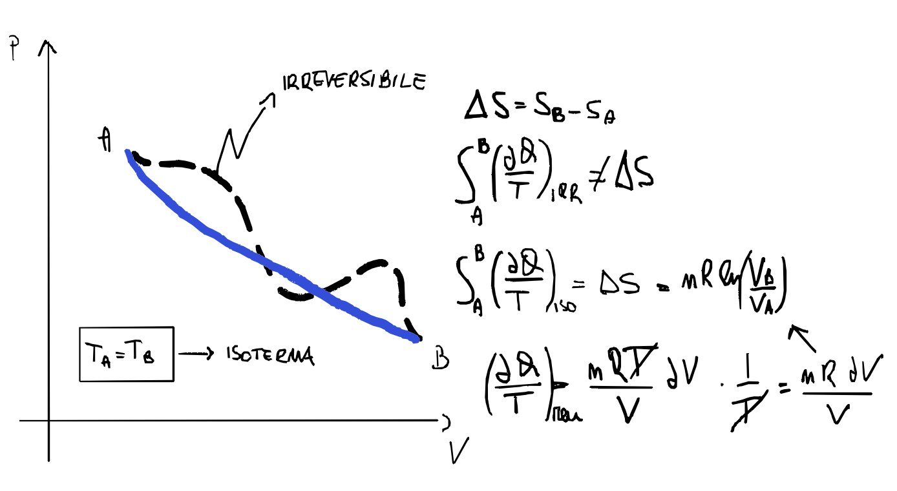

###### todo
- calcola entropia per le varie trasformzazioni gas ideali

###### Interpretazione probabilistica dell'entropia
- todo

---

## DA SISTEMARE
- Zero assoluto
- funzioni di stato

## Domande

##### {{ counter }}) Si commentino i tre modi di conduzione del calore affrontati a lezione.

---

##### {{ counter }}) Si enunci il primo principio della termodinamica. Spiega il significato dei segni delle quantità calore e lavoro _hint: convenzione_

---

##### {{ counter }}) Definisci capacità termica. è un’equazione scalare o vettoriale? Quali sono le unità di misura?

---

##### {{ counter }}) Equazione che descrive lo scambio di calore tra due oggetti posti a contatto termico

---

##### {{ counter }}) Primo principio della dinamica. _hint: Nella formulazione NON COMPARE la parola forza!_

---

##### {{ counter }}) Si disegnino le vettori trasformazioni termodinamiche studiate.

---

##### {{ counter }}) Per comprimere un gas facendo meno lavoro possibile che trasformazione ci conviene usare? _hint adiabatica_

---

##### {{ counter }})  Ha un senso che un gas abbia una pressione negativa? Perché no?

---

##### {{ counter }}) Cos’è una trasformazione quasi-statica? + definizione trasformazione reversibile

---

##### {{ counter }}) Teorema di Carnot. Una macchina potrebbe lavorare anche fra più di due sorgenti, il teorema di Carnot tra quale di queste due sceglie?_hint Massima e minima_

---

##### {{ counter }}) Cos’è il rendimento?

---

##### {{ counter }}) Si enuncino tutte le formulazioni conosciute del secondo principio della termodinamica. _hint due (forse tre con l’entropia?_

---

##### {{ counter }}) Equazione di stato dei gas perfetti. Perché la temperatura si misura in Kelvin e non in Celsius?

---

##### {{ counter }}) Cos’è un serbatoio di calore (o sorgente di temperatura)? _hint corpo in grado di cedere/assorbire calore senza variare la sua temperatura in maniera apprezzabile_

---

##### {{ counter }}) Teoria cinetica dei gas, basi, disegno e risultato.

---

##### {{ counter }}) Energia interna dei gas perfetti

---

##### {{ counter }}) Definizione di entropia.

---

##### {{ counter }}) Consideriamo un cilindro che contiene un fluido e mettiamo sopra un pistone, e immaginiamo di comprimere il fluido. Come si calcola il lavoro nel caso in cui avvenga per stadi quasi-statici (integrale pdV) e quando invece non avviene (sinceramente non lo so).

---

##### {{ counter }}) Integrale di Clausius.

---

##### {{ counter }}) Primo principio della termodinamica.

---

##### {{ counter }})  Si elenchino le trasformazioni termodinamiche visto e se ne discutano le proprietà.

---

##### {{ counter }}) Come mai ΔU trovato per le isocore è lo stesso per tutte le trasformazioni? _Hint: Perché è una funzione di stato_

---

##### {{ counter }}) Secondo principio della termodinamica + dimostrazione (se l’è chiamata)

---

##### {{ counter }}) Mi parli dei cambi di fase

---

##### {{ counter }}) Cos’è l’energia interna (termodinamica)?

---

##### {{ counter }})  Mi parla del ciclo di Carnot?

---

##### {{ counter }}) Convezione.

---

##### {{ counter }})  Consideriamo un cubetto che si trovi a -20 gradi Celsius, inizio a dare calore al ghiaccio, che succede?

---

##### {{ counter }}) Quanto vale la variazione di entropia nel processo di fusione?

---

##### {{ counter }}) Quanto vale la variazione di entropia per una trasformazione adiabatica.

---