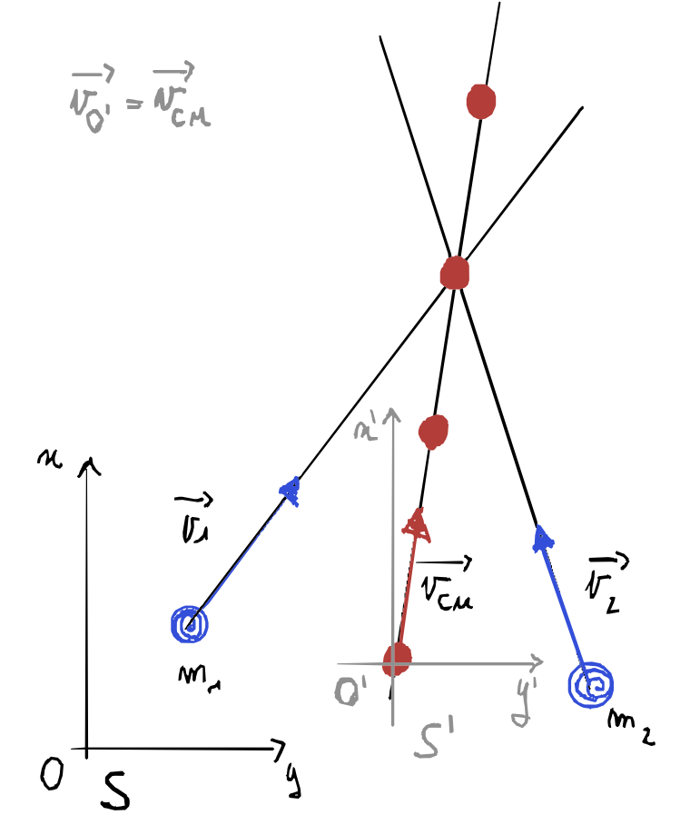

# Urti
Si parla di __urto__ quando due corpi interagiscono violentemente in un intervallo di tempo trascurabile rispetto ai tempi di osservazione del loro moto prima del contatto.

In particolare si parla di urto quando due masse $m_1$ e $m_2$ interagiscono dinamicamente tra loro, modificando la loro quantità di moto.

---
###### Forze impulsive
Le forze in gioco durante l'interazione dei due corpi sono molto intense e agiscono per un tempo breve, queste sono chiamate __forze impulsive__. 

---
###### Conservazione quantità di moto
Se consideriamo il sistema dei due corpi, durante l'urto intervengono tra di loro solo forze interne al sistema, ne consegue che in assenza di forze esterne la quantità di moto del sistema si conserva.

> $$\vec p_{in} = m_1 \vec v_1 + m_2 \vec v_2 = m_1 \vec {v_1}' + m_2 \vec {v_2}' = \vec p_{fi}$$
>
>$$ \vec p = (m_1+m_2) \vec v_{CM} =\vec p_{in} = \vec p_{fi} = \mathtt {cost}$$
>

$$
\begin{cases}
m_1 \vec {v_1'} - m_1 \vec {v_1} = J_{2\rightarrow 1} =  \int_{t_1}^{t_2} \vec F_{2\rightarrow 1} dt\\
\\
m_2 \vec {v_2'} - m_2 \vec {v_2} = J_{1\rightarrow 2} =  \int_{t_1}^{t_2} \vec F_{1\rightarrow 2}dt
\end{cases} 
\quad \Rightarrow \quad 

\begin{cases}
\vec F_{1\rightarrow 2} = - \vec F_{2\rightarrow 1} \\
\quad\quad \;\,\Downarrow \\
J_{1\rightarrow 2} = - \vec J_{2\rightarrow 1} 
\end{cases} 
$$

---
_Da notare che se vi fosse una forza di attritto, tale forza è esterna al sistema, ma i tempi brevi dell'urto ci permettono di trascurarne l'effetto._

Quindi possiamo conservare la quantità di moto anche nel caso ci siano forze esterne, ma queste devono essere non impulsive e la durata dell'impatto $\tau$ deve essere breve:

$$\Delta p = \int _{t_1}^{t_2} \vec F^{(E)} dt = \vec F_m^{(E)} \tau \ll \vec F_m\tau$$

con $\vec F_m$ il valore medio della forza impulsiva nell'intervallo $\tau$.

---
###### Definizione urto
> L'urto è un processo in cui l'interazione tra i punti materiali abbia un'intensità molto grande rispetto alle eventuali forze esterne presenti.
> - comporta uno scambio di quantità di moto tra i due punti sotto forma di impulsi dovuti alle forze interne tra essi
> - nell'urto la quantità di moto del sistema si conserva

---
###### Sistema del laboratorio e del centro di massa
Consideriamo un urto osservato da due sistemi di riferimento: uno inerziale (_fisso_) e uno solidale con il centro di massa, che si muove con velocità traslazionale $\vec v_{O'} = \vec v_{CM}$. Il passaggio da un sistema all'altro è un cambiamento Gallileiano.

Vale sempre che le velocità nei due sistemi siano in relazione:

$$
\vec v_1 = \vec v_{CM} + \vec v_{1'}
$$

$$
\vec v_2 = \vec v_{CM} + \vec v_{2'}
$$

La quantità di moto nel sistema del centro di massa è nullo:

$$
\vec p = m_1 \vec v_1 + m_2 \vec v_2 = m_1 \vec {v_1'} + m_2 \vec {v_2'} + (m_1 + m_2) \vec v_ {CM} \quad \rightarrow   \quad m_1 \vec {v_1'} + m_2 \vec {v_2'}  = 0
$$

###### Urto Elastico
In un urto elastico si conserva anche l'energia cinetica del sistema. Questo significa che le forze interne che si manifestano durante l'urto siano conservative.

Possiamo usare le equazioni:

$$
\vec p_{in} = \vec p_{fi}
$$

$$
E_{k,in} = E_{k,fi}
$$

E risolvere il sistema:

$$
\begin{cases}
m_1 \vec v_{1,i} + m_2 \vec v_{2,i} = m_1 \vec v_{1,f} + m_2 \vec v_{2,f}\\
\frac 12 m_1 v_{1,i}^2 + \frac 12 m_2 v_{2,i}^2 = \frac 12 m_1 v_{1,f}^2 + \frac 12 m_2 v_{2,f}^2
\end{cases}
$$

Conoscendo le masse e le velocità iniziali e dovendo trovare le velocità finali nei problemi a:
- 1 dimensione ho 2 equazioni a 2 incognite ($v_{1,f}$ e $v_{2,f}$)
- 2 dimensione ho 3 equazioni a 4 incognite
- 1 dimensione ho 4 equazioni a 6 incognite

Quindi solo a una dimensione abbiamo un sistema deterministico.

---

## Urto completamente anelastico
Nell'__urto completamente anelastico__ i due punti rimangono attacati dopo l'urto formando un unico corpo di massa $m_1+ m_2$.

$$
m_1 \vec v_1 + m_2 \vec v_2 = (m_1 + m_2) \vec v' = (m_1 + m_2) \vec v_{CM}
$$

$$
\vec v_{CM} = \frac {m_1 \vec v_1 + m_2 \vec v_2}{(m_1 + m_2)} 
$$

In questo caso l'energia cinetica:

$$
E_{k,in} = \frac 12 m_1 v_1^2 + \frac 12 m_2 v_2^2 = {E'}_{k,in} + \frac12 (m_1 + m_2) v_{CM}^2
$$

Sapendo che:

$$
E_{k,fi} = \frac12 (m_1 + m_2) v_{CM}^2 < E_{k,in}
$$

Questo avviene perché durante l'urto i due corpi che abbiamo trattato come punti materiali subiscono deformazioni in modo permanente. Il lavoro compiuto per far avvenire la deformazione non viene più recuperato, cioè le forze interne durante l'urto non sono conservative.

###### urto anelastico (non completamente)

- TODO

###### Pendolo Balistico

- TODO

---
## Domande


##### {{counter}}) Si descrivano gli urti. La legge della conservazione della quantità di moto è un’equazione scalare o vettoriale? _hint: vettoriale_

---

##### {{counter}}) Negli urti anelastici l’energia cinetica finale è > o < della somma delle energie cinetiche dei singoli corpi?

---

##### {{counter}})  Qual è la proprietà che assumiamo quando parliamo di urti? _Hint: L’urto deve avvenire in una durata di tempo infinitesima, trascurabile rispetto al nostro fenomeno d’interesse_

---

##### {{counter}}) in un pendolo balistico si conficca una freccia. Descrivi cosa avviene. Definizione di urto perfettamente anelastico _hint quando una gran parte dell’energia cinetica viene impiegata per l’unificazione delle masse_

---

