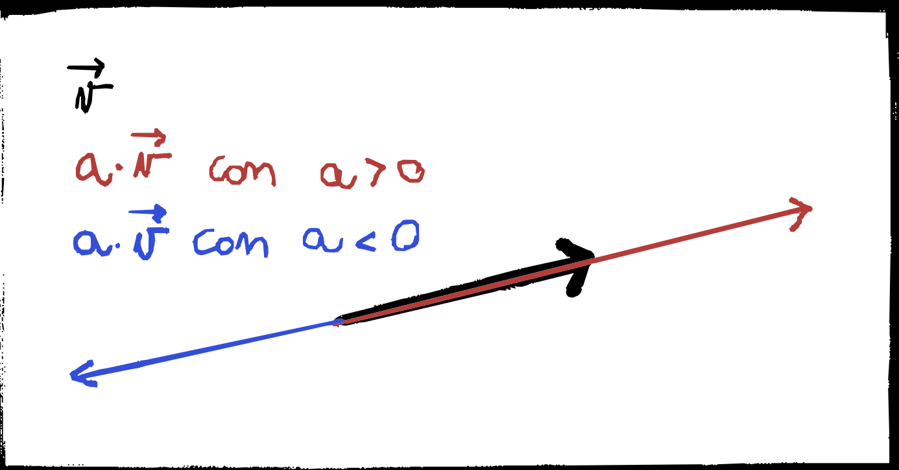
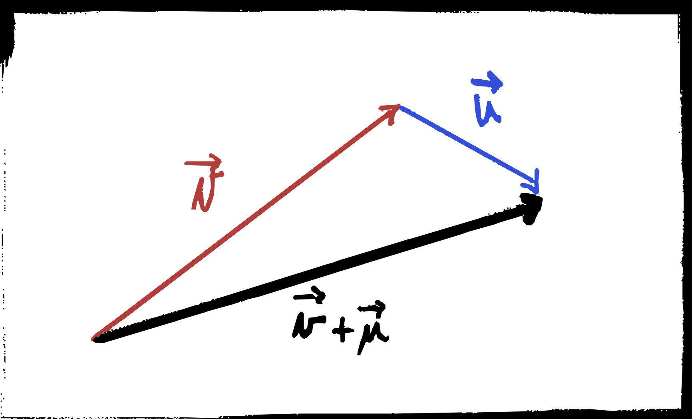
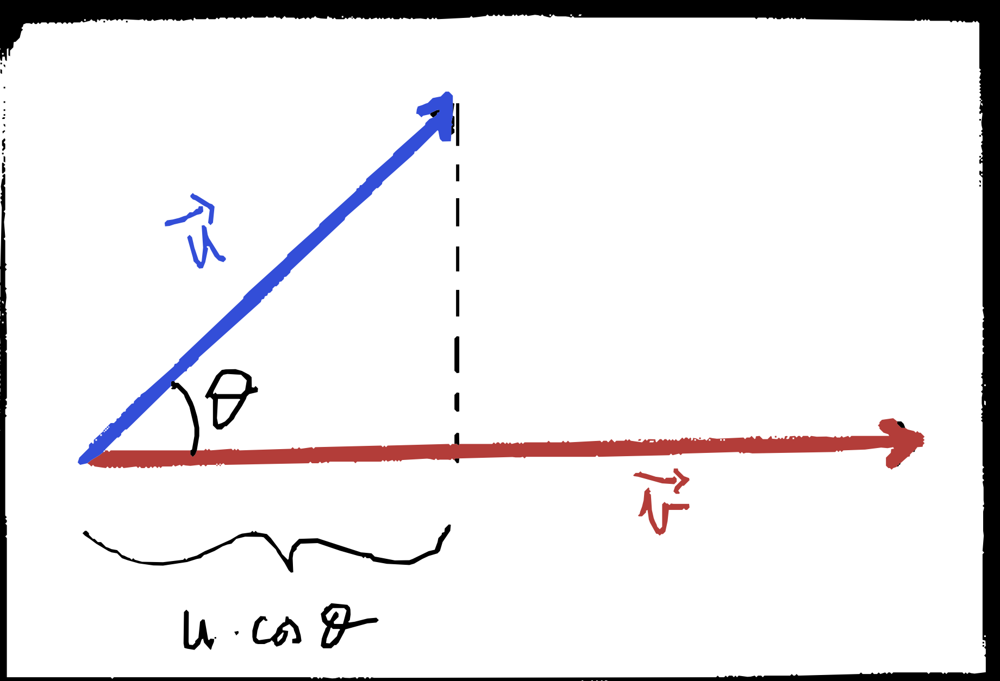
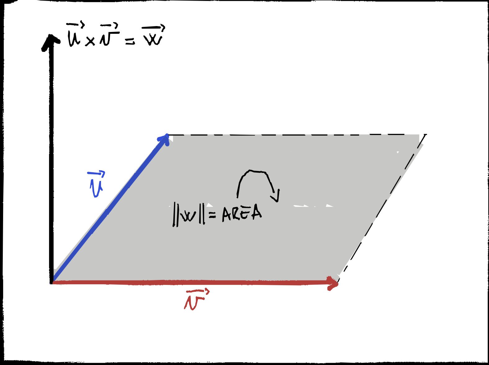

# Varie
## Disegna le operazioni vettoriali che abbiamo studiato.

### Prodotto tra un vettore ed uno scalare

 

Il prodotto di uno scalare $m$ (numero) per un vettore $\vec a$ ha come risultato un nuovo vettore avente stessa direzione di $\vec a$ e modulo $\lvert m \rvert$ volte quello di $\vec a$, lo stesso verso di $\vec a$ se $m > 0$, mentre verso opposto se $m<0$. 

Grazie a questa operazione possiamo esprimere ogni vettore come il prodotto scalare del suo modulo per il vettore unitario $\hat u$ avente modulo 1 e direzione concorde ad $\hat a$. $$\vec a = a\cdot \hat u$$

### Somma tra vettori

 

Dati due vettori $\vec a$ e $\vec b$ la loro somma è un vettore, detto vettore somma e indicato come $$\vec c = \vec a + \vec b$$
Esso si ottiene graficamente disegnando il vettore $\vec b$ con punto di applicazione coincidente con il punto terminale di $\vec a$ e collegando il punto di applicazione di $\vec a$ con il punto terminale di $\vec b$. 

Un'altra regola detta __del parallelogramma__: si disegnano il punto di applicazione di $\vec a$ e $\vec b$ coincidenti e $\vec c$ si ottiene disegnando la diagonale del parallelogramma con lati $\vec a$ e $\vec b$. Da quest'ultima regola si vede che la somma tra vettori è commutativa.

Si noti che con la somma si definisce implicitamente anche la differenza tra vettori, basti prendere l'opposto: $$\vec c = \vec a + (-\vec b)$$
Nel caso di vettori paralleli si ha: $$\vec a_1 + \vec a_2 = a_1 \hat u + a_2 \hat u = (a_1 + a_2) \hat u$$
Dato un sistema di riferimento è utile _scomporre_ il vettore nelle sue componenti rispetto agli assi, quindi per esempio nel piano $$\vec a = a_x\cdot \hat u_x + a_y\cdot \hat u_y $$

### Prodotto scalare

 
Dati due vettori $\vec a$ e $\vec b$ si definisce prodotto scalare la quantità 
$$s = \vec a \cdot \vec b = ||\vec a||\cdot ||\vec b|| \cdot \cos \theta$$

con $\theta$ l'angolo formato dai due vettori. Il risultato del prodotto scalare è uno scalare e gode delle seguenti:
1. il prodotto scalare è nullo solo se uno dei due vettori è nullo o se l'angolo compreso è $\frac\pi 2$ 
2. vale la proprietà commutativa 
$$\vec a \cdot \vec b = ||\vec a || \cdot || \vec b|| \cdot \cos (\theta) = ||\vec b || \cdot || \vec a|| \cdot \cos (-\theta) = \vec b \cdot \vec a$$
3. 
$$
\vec a\cdot \vec a = || \vec a||\cdot || \vec a||\cdot \cos(0) =  || \vec a||^2
$$
4. vale la proprietà distributiva
5. non ha senso iterare il prodotto scalare: $\vec a \cdot \vec b \cdot \vec c$ è priva di senso perché appunto $\vec a \cdot \vec b$ è uno scalare e non può essere moltiplicato scalarmente per $\vec c$
6. se $\vec c = \vec a + \vec b$ dalla proprietà distributiva e dalla [3](#3) allora $$||\vec c||^2 = (\vec a + \vec b)\cdot(\vec a + \vec b) = ||\vec a ||^2 + ||\vec b ||^2 + 2||\vec a||\, ||\vec b|| \cos \theta$$ se $\vec a \perp \vec b$ allora $$c^2 = a^2 + b^2$$
Fare il prodotto scalare tra due vettori scomposti negli assi ricordando che: $$\hat u_x \cdot \hat u_x = 1\quad \hat u_x \cdot \hat u_y = 0$$ si ottiene che il prodotto scalare risulta uguale alla somma dei prodotti delle componenti omologhe sugli assi: $$\vec a \cdot \vec b = a_x b_x + a_y b_y$$

Infine un altro modo per visualizzare il prodotto scalare è quello di pensarlo come la moltiplicazione del modulo della proiezione di un vettore sul altro con il modulo del altro vettore.

### Prodotto vettoriale

 

Il prodotto vettoriali di due vettori $\vec a$ e $\vec b$ risulta in un vettore $\vec c$ e si indica con $$\vec c = \vec a \times \vec b$$ ed ha le seguenti caratteristiche:
1. la _direzione_ è ortogonale al piano identificato da $\vec a$ e $\vec b$ 
2. il _verso_ è definito dalla regola della regola della mano destra 
3. il _modulo_ $c = a \cdot b \cdot \sin \theta$ che corrisponde all'area del parallelogramma di lati a e b, di fatti $a\sin \theta$ corrisponde all'altezza del rettangolo con base b e viceversa.
Il prodotto vettoriale è _anticommutativo_: $$\vec a \times \vec b = - \vec b \times \vec a $$
Il prodotto vettoriale è nullo se uno dei due vettori è nullo o se i due vettori sono paralleli.
Il prodotto vettoriale si può iterare, ma non è associativo quindi va specificato l'ordine.

### todo
- derivata di un vettore
- integrale ???

---

## Quali sono le forze fondamentali della natura?
Le forze fondamentali della natura sono la forza Gravitazionale, la forza Elettromagnetica, la forza Forte e quella Debole

---

## Operazioni tra vettori. Prodotto vettoriale. Prodotto Scalare.
[risposta precedente](#disegna-le-operazioni-vettoriali-che-abbiamo-studiato)

## Radianti
